## 2020秋 人工智能导论项目报告 Group1 Human Eye

#### 队长：黄钊恒 2018202064

#### 队员：郝文轩 2018200077

***

### 0. 项目介绍

#### 项目名称：基于中国古代史的知识问答系统

在本次项目中，我们搭建了文本识别（OCR）模型，研究了语音识别（ASR）模型，并构建了自己的知识图谱，从上述生成的文本中学习，通过聊天机器人的形式，实现在GUI界面中与用户的智能交流。用户输入包含中国古代史线索的图片（需将其放在指定文件夹下），在模型识别后输入知识图谱并分析，针对用户输入的每个问题，该模型返回对应的准确答案。 

我们录制了使用该软件的全过程，并上传至视频网站Bilibili，以展示我们的项目成果。

==视频地址==：https://www.bilibili.com/video/BV1ra4y1H7Pw/

实验环境：

>OS：MacOS v11.0.1 Big Sur / Windows 10
>
>python: v3.8.3
>
>Pytorch: v1.6.0
>
>Keras: v2.2.4
>
>warpctc_pytorch.CTCLoss网络架构模型

##### warpctc_pytorch配置方法

>1. git clone https://github.com/SeanNaren/warp-ctc.git
>2. cd warp-ctc
>3. mkdir build; cd build
>4. cmake ..
>5. make
>6. cd ../pytorch_binding
>7. python setup.py install

### 1. OCR模型

#### 1-1. 数据集

我们使用的数据集为Synthetic_Chinese_String_Dataset中文识别数据集，大小9.23GB，已经上传至百度网盘：

>```
>链接：https://pan.baidu.com/s/1Ef-USCOP5F5cSfmNQESkNw 
>提取码：1giy
>```

本数据集包含3600000张大小相同的简体中文短语图片，以及每张图片对应的标注信息。

#### 1-2. 网络架构

我们采取了VGG16 + BiLSTM + CTC的CRNN网络架构作为我们的OCR识别模型，并取得了极高的识别准确率（97%）。以下代码均在modules.py中。

##### 1-2-1. VGG16

我们选择了VGG16作为模型中的卷积网络部分进行特征提取。

我们的VGG16代码如下所示：

```python
import torch
import torch.nn.functional as F


class Vgg_16(torch.nn.Module):

    def __init__(self):
        super(Vgg_16, self).__init__()
        self.convolution1 = torch.nn.Conv2d(1, 64, 3, padding=1)
        self.pooling1 = torch.nn.MaxPool2d(2, stride=2)
        self.convolution2 = torch.nn.Conv2d(64, 128, 3, padding=1)
        self.pooling2 = torch.nn.MaxPool2d(2, stride=2)
        self.convolution3 = torch.nn.Conv2d(128, 256, 3, padding=1)
        self.convolution4 = torch.nn.Conv2d(256, 256, 3, padding=1)
        self.pooling3 = torch.nn.MaxPool2d((1, 2), stride=(2, 1)) # notice stride of the non-square pooling
        self.convolution5 = torch.nn.Conv2d(256, 512, 3, padding=1)
        self.BatchNorm1 = torch.nn.BatchNorm2d(512)
        self.convolution6 = torch.nn.Conv2d(512, 512, 3, padding=1)
        self.BatchNorm2 = torch.nn.BatchNorm2d(512)
        self.pooling4 = torch.nn.MaxPool2d((1, 2), stride=(2, 1))
        self.convolution7 = torch.nn.Conv2d(512, 512, 2)

    def forward(self, x):
        x = F.relu(self.convolution1(x), inplace=True)
        x = self.pooling1(x)
        x = F.relu(self.convolution2(x), inplace=True)
        x = self.pooling2(x)
        x = F.relu(self.convolution3(x), inplace=True)
        x = F.relu(self.convolution4(x), inplace=True)
        x = self.pooling3(x)
        x = self.convolution5(x)
        x = F.relu(self.BatchNorm1(x), inplace=True)
        x = self.convolution6(x)
        x = F.relu(self.BatchNorm2(x), inplace=True)
        x = self.pooling4(x)
        x = F.relu(self.convolution7(x), inplace=True)
        return x  # b*512x1x22
```

我们的模型网络结构可视化展示如下：


##### 1-2-2. BiLSTM

在序列信息学习部分，我们采用了RNN中的BiLSTM网络结构。

```python
class RNN(torch.nn.Module):
    def __init__(self, class_num, hidden_unit):
        super(RNN, self).__init__()
        self.Bidirectional_LSTM1 = torch.nn.LSTM(512, hidden_unit, bidirectional=True)
        self.embedding1 = torch.nn.Linear(hidden_unit * 2, 512)
        self.Bidirectional_LSTM2 = torch.nn.LSTM(512, hidden_unit, bidirectional=True)
        self.embedding2 = torch.nn.Linear(hidden_unit * 2, class_num)

    def forward(self, x):
        x = self.Bidirectional_LSTM1(x) 
        T, b, h = x[0].size() 
        x = self.embedding1(x[0].view(T * b, h))
        x = x.view(T, b, -1)
        x = self.Bidirectional_LSTM2(x)
        T, b, h = x[0].size()
        x = self.embedding2(x[0].view(T * b, h))
        x = x.view(T, b, -1)
        return x 
```

将上述代码可视化展示如下（由于图片太长，我们将其分割成几部分展示）：

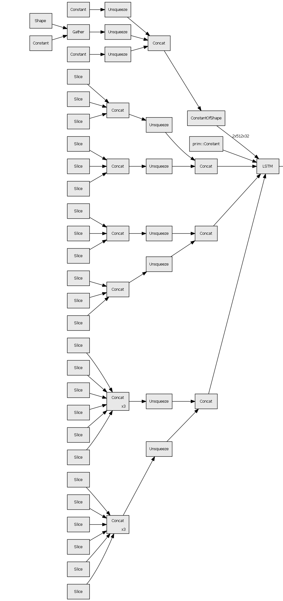


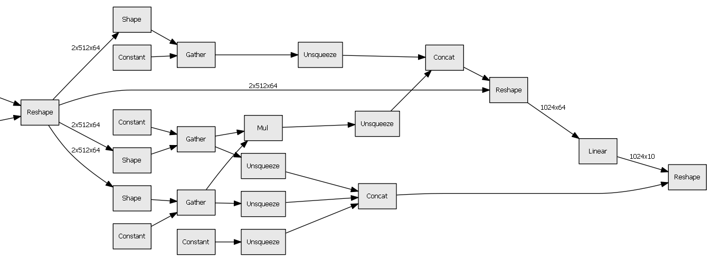

##### 1-2-3. CRNN

除以上两个核心部分外，我们还设计了CTC网络，计算输入的特征序列（向量）最可能对应的标签对象。

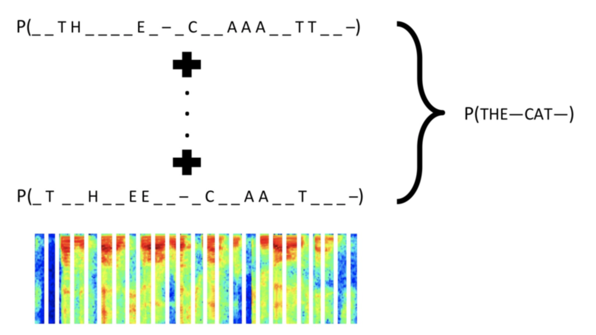

pytorch框架中实现了CTC网络，我们直接调用以下语句，即可在前文所述网络中添加CTC层。

```python
from warpctc_pytorch import CTCLoss
ctc_loss = CTCLoss()
```

在CTC序列对齐解码后，我们将这三部分结合，就生成了CRNN网络结构。

代码实现部分如下：

```python
class CRNN(torch.nn.Module):
    def __init__(self, class_num, hidden_unit=256):
        super(CRNN, self).__init__()
        self.cnn = torch.nn.Sequential()
        self.cnn.add_module('vgg_16', Vgg_16())
        self.rnn = torch.nn.Sequential()
        self.rnn.add_module('rnn', RNN(class_num, hidden_unit))

    def forward(self, x):
        x = self.cnn(x)
        b, c, h, w = x.size()
        assert h == 1
        x = x.squeeze(2) 
        x = x.permute(2, 0, 1)
        x = self.rnn(x)
        return x
```

在训练后，我们输入了两组图片，均获得了非常好的结果。（这些在第七周时已经完成）


#### 1-3. 模型优势与不足

优势：

1. 我们从底层开始，利用pytorch接口设计了ocr模型所有必需的网络结构；
2. 我们采用了格式化的数据集，拥有相同的大小与准确的标签信息；
3. 我们创建了一个目录存储数据集，这样即使数据集需要更换，也能顺利过渡，这对于项目开发减少了很多不必要的麻烦。
4. 我们拥有学校云计算平台资源，因此可以调用优质显卡资源训练我们的模型。

不足：

1. 查阅相关论文，我们发现==在自然场景文字检测下==，增加一层CTPN，对文本块的定位以及适用性有大幅度的提升。但由于时间有限，且相对于CRNN而言，我们并不太熟悉CTPN相较CRNN的相关创新原理，有关论文也相对匮乏，但是在目前的背景假设下，我们已经能检测绝大多数环境（如聊天记录等包含多种颜色的场景）中的文字，项目完成度较高。我们初步构建出了CTPN网络，并未将其融合到模型当中。

我们初步构建的CTPN网络，包含VGG16+BiLSTM+FC+RPN，核心代码如下所示：

```python
   class CTPN_Model(nn.Module):
       def __init__(self):
           super(CTPN_Model, self).__init__()
           self.cnn = nn.Sequential()
           self.cnn.add_module('Vgg_16', Vgg_16())
           self.rnn = nn.Sequential()
           self.rnn.add_module('Im2col', Im2col((3, 3), (1, 1), (1, 1)))
           self.rnn.add_module('RNN', RNN(3 * 3 * 512, 128))
           self.FC = nn.Conv2d(256, 512, 1)
           self.vertical_coordinate = nn.Conv2d(512, 4 * 10, 1)
           self.score = nn.Conv2d(512, 2 * 10, 1)
   
       def forward(self, x, val=False):
           x = self.cnn(x)
           x = self.rnn(x)
           x = self.FC(x)
           x = F.relu(x, inplace=True)
           vertical_pred = self.vertical_coordinate(x)
           score = self.score(x)
           return score, vertical_pred
```

### 2. 语音识别

在本项目中，所需的ASR模型更加复杂，因为其要识别不同的人声等，且要根据上下文在同音字中选择最匹配的文字，但我们探索研究并构建了一个mfcc+VGG16(with Densenet)模型（虽然我们并没有将其用于最终的项目中）预处理：设置采样率为18000Hz，将每个汉字发音拉伸至1s。如下图所示：


我们使用了清华大学THCHS30中文语音数据集（网址：https://github.com/nl8590687/ASRT_SpeechRecognition）一共5.2G，且模型参数如下图所示：

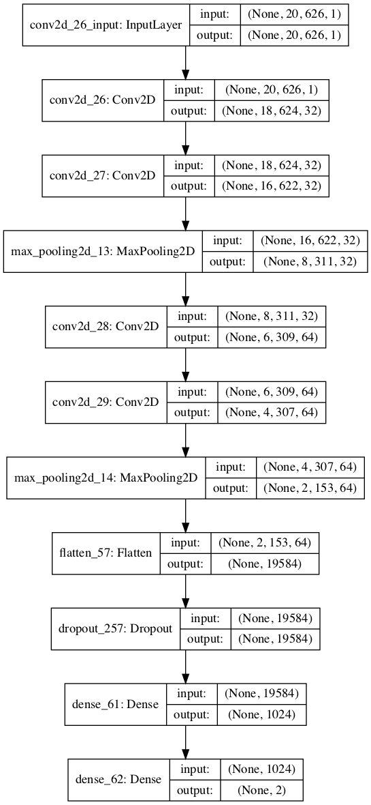

200个epoch后，模型收敛，训练过程如下：

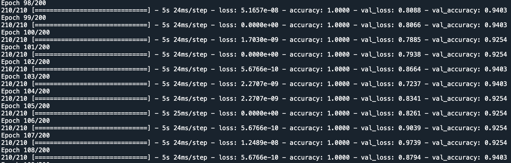

损失函数如下：

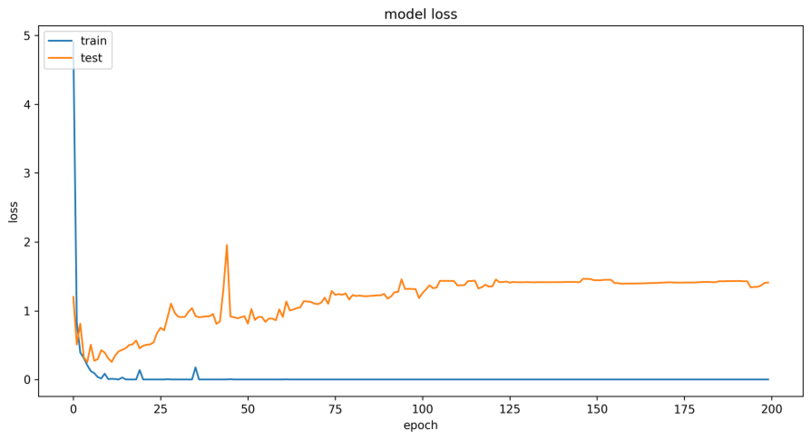

精确度函数如下：


在该数据集中，划分10%的validation dataset，得到精确度为92.5%。

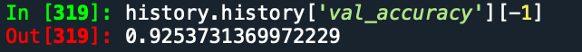

考虑到，==古代史中存在不少生僻字以及不同的语法==，在==同音字识别==中，有极大可能返回不同的汉字，对知识图谱的构建产生较大影响，因此ASR模型不适合于我们的课题。我们将重点放在OCR模型，但我们仍然花费了很多时间在对ASR模型的探索和研究中，并获得了很大的收获。

### 3. 知识图谱

以上文的介绍作为基础，我们==获取了40张中国古代史线索图片作为无标注测试集==，将其放在history文件夹下，在GUI窗口中输入history文件夹名称，其获取底下所有的图片，并一一识别。在约19分钟后，在文本框中显示内容如下图所示。

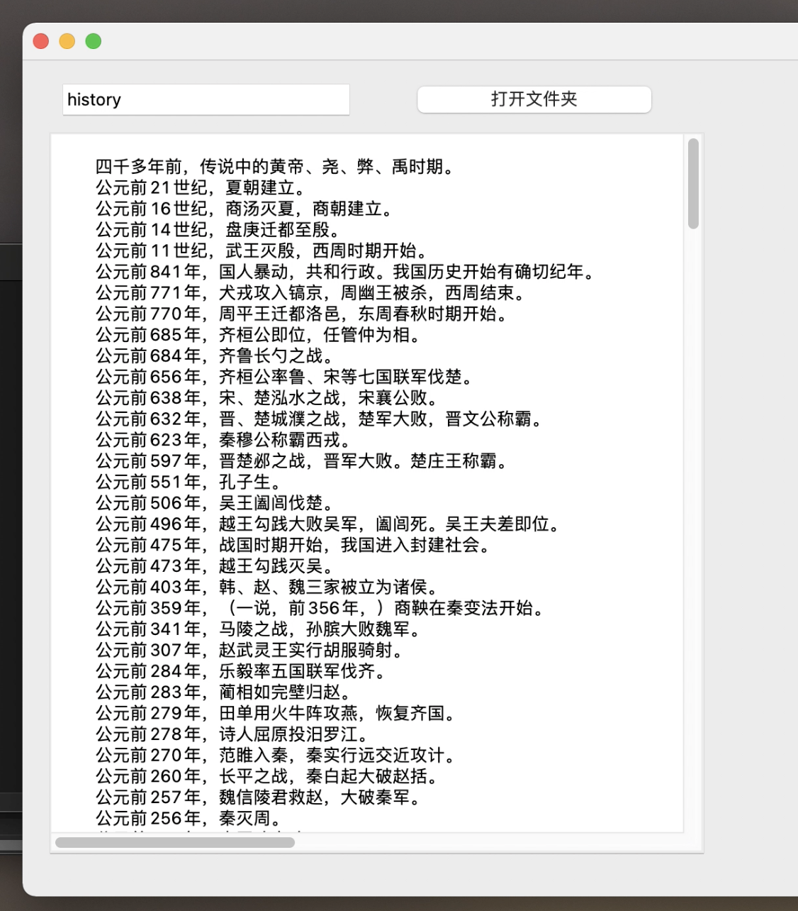

注意，在识别过程中，我做了基本的数据预处理，如有针对性地将可能被判错的“。”进行进一步识别；如将半角符号改为全角符号。

这样处理后，我们可以看到这个结果符合HumanEye预期识别的结果（即：人眼的识别结果与算法识别结果相似），每一个句子都是完整的。这样就可以进入“知识图谱”步骤。

对于每个句子，先利用jieba分词划分出每个词语，再通过entity_info_v1.txt实体专名词典赋予每个词语一个“角色”，这样每个词语在句子中的成分就被确定下来了。（这个过程，即为自然语言处理中的命名实体识别技术，这一部分我调用了pyhanlp的命名实体识别接口，其提供了诸如上述entity_info_v1.txt等重要数据，因此在面对古文时，我能准确识别出每个词语的实体类别）

同时，每个成分的地位不尽相同。例如，在一个句子中最重要的成分为主谓宾，因此将主谓宾三个成分提取出来，构成一组RDF三元组。主语与宾语作为节点，谓语作为有向边。多个三元组组合在一起，就成为了一个有向图，这就是知识图谱。在最终的项目中，为提升美观性，我将知识图谱图像展示部分注释了。如果需要生成图像，则将GUI_code.py中的plt.show()的注释符号删除即可。

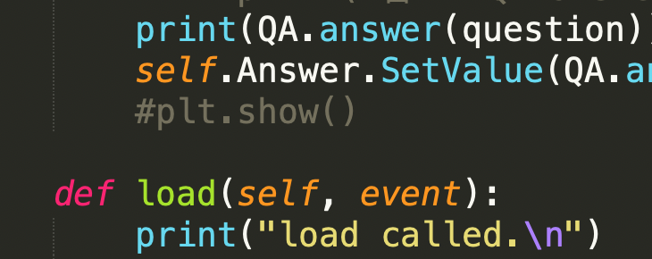

去除注释，最后得到的知识图谱图像如下（使用networkx实现绘图部分）：

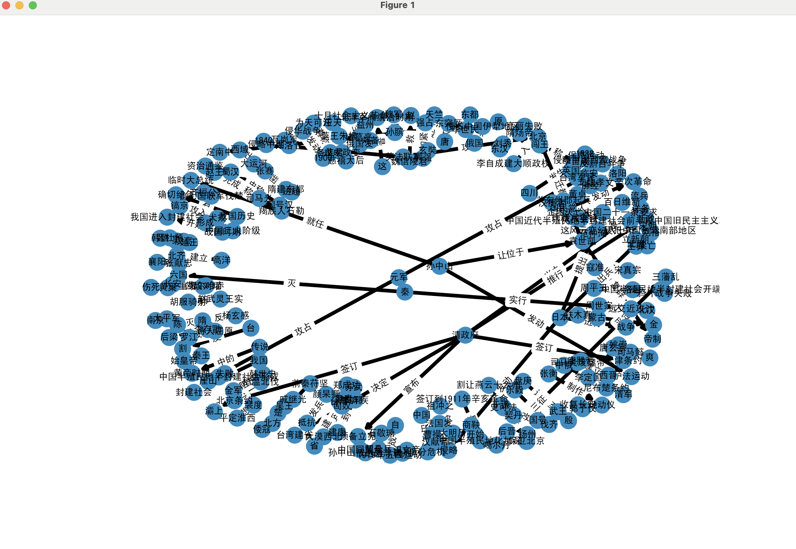

### 4. 聊天机器人

在KGQA.py中，我们实现了聊天机器人，在GUI界面的右侧，该脚本能处理输入的问题语句并返回答案，输出在屏幕上。

在知识图谱部分，我们引入了*SPARQL*(*SPARQL* Protocol and RDF Query Language)语言，在此部分我们运用这种语言，在知识图谱的有向图中寻找合适的关系，

本质上，SPARQL就是查询上述的知识图谱关系网。流程如下：

1. 对输入语句进行分割，找出主谓宾。（运用前文所述方法）
2. 将主谓宾作为三元组，找到其中缺失的部分（例如，谁、什么等词）
3. 在知识图谱中找到未缺失的主语或宾语，从这个节点开始搜索其相邻节点，判断其相连边是否符合RDF三元组中的关系。

我使用python模拟了SPARQL查询的流程，如图所示：

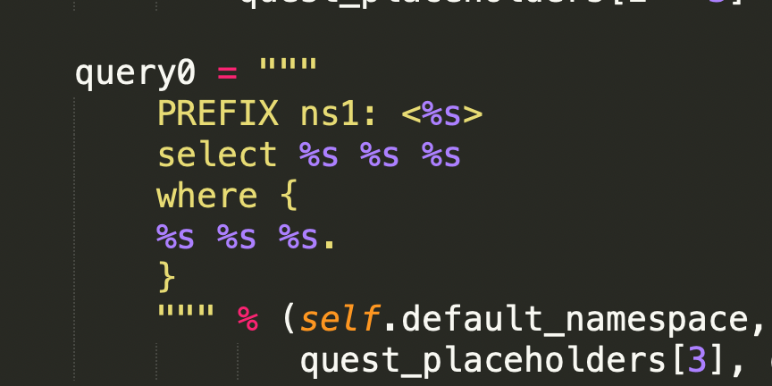

用字符串和占位符模拟查询语句，当处理语句时，处理的对象也是字符串——这就与python-sql语句查询非常类似。

并==准备了26个问题==，如下图所示：


可以见得，这些问题中包含了何时、何地、何物、何人等缺失项。在三元组中，SPARQL可以挖掘出知识图谱网络中的答案。


在代码中，我们设计了一个KGQA类，输入相应的语句以及RDF三元组，就能搜索并返回答案。如图所示：

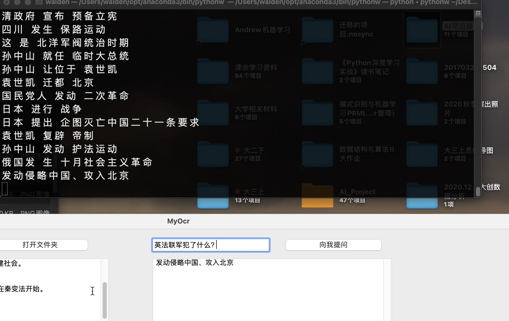

在视频中，可以发现，这26个问题，在模型处理后均返回了完善的答案。这就达成了我们基于中国古代史的知识问答系统设计目的。

### 5. 实验总结

我们利用深度学习技术开发了基于中国古代史的知识问答系统设计，搭建了OCR、ASR模型，并学习了知识图谱构建，在此基础上设计了一个聊天机器人与用户交流，通过了图灵测试。在这个过程中，我们运用我们所学的深度学习知识，阅读文献，设计了一个综合的CRNN网络架构，并部署云端，在大数据集上进行训练，将训练好的参数模型下载，在输入的40张图片上测试，得到结果后构建知识图谱，并运用SPARQL挖掘所需的问题答案。

值得一提的是，我们的项目针对实际问题设计，故考虑实际意义，将来若有更庞大的知识框架、更复杂的内容，本项目也能凭借模型与算力适应新的数据集。

#### 6. 参考文献与资料

http://openaccess.thecvf.com/content_ICCV_2017/papers/Cheng_Focusing_Attention_Towards_ICCV_2017_paper.pdf

https://blog.csdn.net/miner_zhu/article/details/85761887

https://blog.csdn.net/yifen4234/article/details/80334516

https://zhuanlan.zhihu.com/p/43534801

https://blog.csdn.net/bestrivern/article/details/100889632

https://www.cnblogs.com/fourmi/p/8973905.html

https://baijiahao.baidu.com/s?id=1667221544796169037&wfr=spider&for=pc

https://blog.csdn.net/th_num/article/details/80597495

https://blog.csdn.net/qq_33266320/article/details/79677993