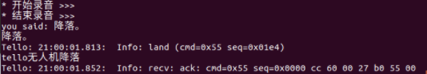
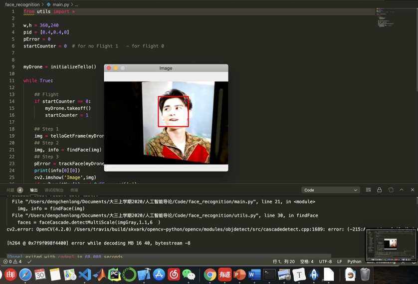

# 无人机实验
赵瑞祥 2018202096
## 项目介绍
我们小组进行有关无人机智能飞行的各项实验，初步打算包括基于音频的语音控制无人机飞行、基于视频的手势控制无人机飞行、人脸追踪的无人机飞行等。

## 基于音频的语音控制无人机飞行
我们基于百度api实现了利用语音控制无人机飞行的功能。比如，当用户说“起飞”后，电脑首先识别用户的语音输入，然后调用相应的对无人机飞行的控制函数takeoff()，无人机就实现了起飞功能。

完整函数代码放在: [/src/scripts/SpeechRecognitionTello.py](/src/scripts/SpeechRecognitionTello.py)

测试语音识别效果如下：

语音控制无人机飞行效果视频见百度网盘：

链接：https://pan.baidu.com/s/1n9AiKVfvzHp84XZP-VlgWQ 

提取码：i7j0 
## 基于人脸识别的人脸追踪的无人机飞行
我们基于多媒体技术课上的图像处理技术实现了人脸自动追踪的无人机飞行控制，无人机会识别摄像头内的人脸，然后自动追踪人脸飞行，包括旋转、上升、下降等。

完整函数代码包括: 

[/src/scripts/aarcascade_frontalface_default.xml](src/scripts/haarcascade_frontalface_default.xml)

[/src/scripts/main.py](src/scripts/main.py)

[/src/scripts/utils.py](src/scripts/utils.py)

人脸识别的效果图如下：

完整人脸追踪的无人机飞行效果视频见百度网盘：

链接：https://pan.baidu.com/s/1n9AiKVfvzHp84XZP-VlgWQ 

提取码：i7j0 