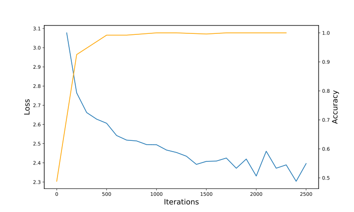

# 终期报告

选题: ReDoPaper:DeepProbLog: Neural Probabilistic Logic Programming

组员: 李国祥, 华思远

我的任务主要是完成各个实验, 结合代码和论文的描述理解论文当中的思想和方法.

## 此前工作总结

修改论文所给的代码, 在理解试验的基础上完成论文中的实验. 还剩下一个实验`coinurn`没有完成.

## 更新的工作

* 完成了最后一次实验`coinurn`直译过来为`硬币和桶游戏`

游戏规则: 有一枚硬币, 两个桶; 一个桶当中有相同数量的<span style="color:red">红球</span>和<span style="color:blue">蓝球</span>, 另一个桶有相同数量的<span style="color:red">红球</span>,<span style="color:blue">蓝球</span>和<span style="color:green">绿球</span>

每次抛一枚硬币并从两个桶当中各取一个球. 获胜的条件:

1. 两个球有相同的颜色
2. 硬币朝上, 且至少取到1个红球.

两者任意满足其中一个即认定为获胜. 

这部分的训练/测试样例为:

```python
game(1069,
     [0.20412266494931064,0.02728010341543563,1.0],								
     [0.0,0.07369723846804527,0.9979793094549361],
     win).

game(59200,
     [1.0,0.11037748734021136,0.0],
     [0.19018903621045982,0.0,0.9875432338733651],
     loss).
```

第一个数为`MNIST`当中图片的编号, 用来模拟硬币. 这样能够体现出投硬币的偏误. 即, 正反面的概率并不是均为0.5

后面两个分别为两个`R,G,B`元组. 这两个元组将会输入到一个输入输出均为长为3的神经网络中, 用于学习桶中球的偏误. 即抽中一个球的概率并非均为1/3.

这部分的规则为

```perl
# 第一部分, 神经谓词
nn(coin_net, [X],Y, [heads,tails]) :: neural_coin(X,Y).
nn(colour_net, [R,G,B],Y, [red, green, blue]) :: neural_colour([R,G,B],Y).

# 第二部分, 先验概率
t(0.5) :: col(1,red); t(0.5) :: col(1,blue).
t(0.333) :: col(2,red); t(0.333) :: col(2,green); t(0.333) :: col(2,blue).
t(0.5) :: coin_heads.

# 第三部分, 游戏规则
outcome(heads,red,_,win).
outcome(heads,_,red,win).
outcome(_,C,C,win).
outcome(Coin,Colour1,Colour2,loss) :- \+outcome(Coin,Colour1,Colour2,win).

# 第四部分, 模拟游戏 
game(Coin,Urn1,Urn2,Result) :-
    coin(Coin,Side),
    urn(1,Urn1,C1),
    urn(2,Urn2,C2),
    outcome(Side,C1,C2,Result).
    
# 组合先验概率和神经谓词
urn(ID,Colour,C) :-
    col(ID,C),
    neural_colour(Colour,C).
coin(Coin,heads) :-
    neural_coin(Coin,heads),
    coin_heads.
coin(Coin,tails) :-
    neural_coin(Coin,tails),
    \+coin_heads.
```

第一部分为神经谓词, 第一行模拟的是抛硬币的神经谓词, 第二行模拟的是抽球的神经谓词.

所以要用到两个神经网络. 抛硬币的神经网络, 输入为一张`MNIST`图片, 输出为硬币正反面. 网络结构如下:

```python
class MNIST_Net(nn.Module):
    def __init__(self, N=10):
        super(MNIST_Net, self).__init__()
        self.encoder = nn.Sequential(
            nn.Conv2d(1, 6, 5),
            nn.MaxPool2d(2, 2), # 6 24 24 -> 6 12 12
            nn.ReLU(True),
            nn.Conv2d(6, 16, 5), # 6 12 12 -> 16 8 8
            nn.MaxPool2d(2, 2), # 16 8 8 -> 16 4 4
            nn.ReLU(True)
        )
        self.classifier =  nn.Sequential(
            nn.Linear(16 * 4 * 4, 120),
            nn.ReLU(),
            nn.Linear(120, 84),
            nn.ReLU(),
            nn.Linear(84, N),
            nn.Softmax(1)
        )

    def forward(self, x):
        x = self.encoder(x)
        x = x.view(-1, 16 * 4 * 4)
        x = self.classifier(x)
        return x

net = MNIST_net(2)
```

即把对论文的`single digit`实验当中对`MNIST`做10分类的网络的最后一层的输出长度改为了2. 作为抛硬币的网络.

抽球的网络则更简单, 等效结构为:

```python
nn.Linear(3, 3)
nn.Softmax(1)
```

第二部分表示先验概率. 从第一个桶抽出红球蓝球的概率各位0.5. 从第二个桶抽出三种球概率各为0.333. 硬币朝上的概率为0.5

第三部分为游戏规则, 和之前所描述的一致.

第四部分模拟一次游戏, 分别为投硬币, 抽两次球, 得到结果.

第五部分为规则定义用先验概率和神经谓词模拟投硬币和抽球的行为.

实验结果: 在数据集上的训练结果如下:



可见`Accuary`很快就达到了100%, 而loss却依然在震荡中下降. 这是由于实验在测试集当中只有64个测试样例. 如果增加测试样例. 则可能可以使loss降低至平稳.

* 重构了代码, 完成了组件之间的分离, 用命令行的形式运行不同的实验, 且可以指定`GPU`

之前的文件结构如下

```
data_loader.py
gradient_semiring.py
logger.py
logic.py
model.py
network.py
optimizer.py
standard_networks.py
start.py
train.py
vector_shape.py
data
test
examples
	|--NIPS
		|--CoinUrn
		|--Forth
			|--Add
			|--Sort
			|--WAP
		|--MNIST
			|--baseline
			|--single_digit
			|--multi_digit
```

为了做论文当中不同的实验, 我们需要进入到各个文件夹当中, 而非在主目录底下进行操作. 同时存在数据的冗余. 部分数据同时出现在根目录的`data`文件夹下, 同时又存在于实验对应的文件夹当中. 而且示例代码是不包含gpu的. 要用gpu(对神经网络部分)进行训练时, 需要修改代码. 现在重新组织代码如下:

```
utils
	|--optimizer.py
	|--logger.py
data
	|--dataloader.py
	|--MNIST
	|--Forth
		|--Add
		|--WAP
		|--Sort
models
	|--neural_networks
	|--...
problog
	|--add.pl
	|--quicksort.pl
	|--...
logic
	|--gradient_semiring.py
	|--..
run.py
```

`utils`存放一些小工具. 比如自定义优化器和`logger`;

`data`存放所有的训练测试数据. 包括`MNIST`和其他所有试验的数据. 以及包括生成数据的代码.

`models`存放所有神经网络结构的定义. 包括`RNN`, `MNIST`的网络等.

`problog`存放所有`problog`语句, 包括`Add`, `Sort`等语句.

`logic`存放所有的`problog`网络以及有关的组件. 包括`gradient_semiring`梯度伴环等.

`run.py`即训练测试实验的执行文件. 指定参数运行这个实验即可运行不同的实验(论文当中的全部都涵盖了). 与此同时, 改变了原先使用`gpu`需要改代码的弊端. 可以直接用`--gpu`参数+设备号即可指定训练时使用的`gpu`设备. 如下为进行`Forth_WAP实验`, 使用5号`gpu`进行实验的命令行

```shell
python run.py --selection Forth_WAP --gpu 5 
```

论文中所有的实验:

```python
{
    "MNIST_baseline", 
    "MNIST_single_digit",
    "MNIST_multi_digit",
    "Forth_Add",
    "Forth_Sort",
    "Forth_WAP",
    "CoinUrn"
}
```

这次汇报介绍了`CoinUrn`, 其他实验在此前的汇报当中都已经介绍过了.

* 对比发现有些实验使用`GPU`似乎训练的速度更慢了. 如`Forth_Add`, 原因可能是本身神经网络简单. 用`cpu`也能获得较好的训练速度. 而`problog`是不支持`gpu`的, 因此使用`gpu`时, 需要把数据从内存放入`gpu`, 再从`gpu`拿回内存. 这样的时间开销可能比使用`gpu`获得的加速更多更大.

## 总结

在理解的基础上完成了论文的所有实验, 从代码当中了解到了`problog`编程和与神经网络相结合编程时的许多细节. 总体来说, 训练的过程呈现出如下的结构. 


这和代码的架构是一致的. 神经网络的概率分布到`problog`语句当中也是很自然了. 比较遗憾的是`Problog`在当前比较热门的计算机视觉领域似乎并不能起到太大作用. 同时其各个组建如何使用也不如`Pytorch`等机器学习框架易学易懂. 同时不支持`gpu`加速. 这可能也是`problog`没能得到快速发展的原因.

修改好的代码随终期报告一并传至github.