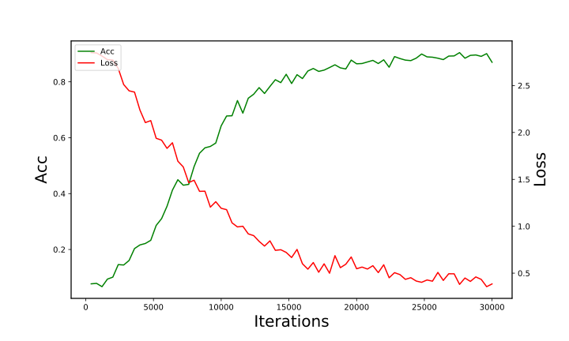

## AI20 · 项目二第二篇

### 项目人员

华思远 (论文阅读理解和帮助代码理解)

李国祥 (代码实现与实验)

### 论文目的

结合低层次的神经网络与高层次的概率逻辑推理。

### 论文方法

在`Problog`的基础上引入神经谓词，得到一门新的语言`DeepProblog`，使用`DeepProblog`建立新的机器学习模型。

使用`aProblog`训练`DeepProblog`建立的机器学习模型。

### 论文的意义

考虑一个谓词`addition(X,Y,Z)`的例子，其中`X,Y`为手写数字图片，`Z`为一个自然数。根据现有的神经网络方法，能够直接用带标签样例训练出一个分类器。

但是如果把`addtion(X,Y,Z)` 写成$addition(I_x; I_Y; N_Z) :- digit(I_x; N_X); digit(I_Y; N_Y); N_Z is N_X + N_Y$的形式，分类器就不需要学习数字相加的规则，只需要学习谓词$digit$（也就是将一个手写体图片识别为一个数字的分类器）。实验表明提出的新模型在识别手写体图片并得到它们的和这一任务中得到优于现有模型的结果。而且由于`Problog`的图灵完备性，新模型能够被用在很多任务中，具有很好的拓展性，因此这篇论文的工作是有意义的。

### 概率逻辑编程概念

`Problog`能很方便地用于概率逻辑编程，其本质是一阶逻辑与概率的组合。`Problog`的程序由`概率事实`和`概率规则`组成。

- 概率事实（命题和原子谓词）

   $0.5::head1$

  $0.6::head2$

  $ 0.5::flip(head);0.5::flip(tail)$

- 概率规则

   以子句的形式给出，形式化推理（命题逻辑和一阶逻辑）

   $bothhead :- head1, head2$

   $0.5 :: head(c1) :- coin(c1)$

   $0.6 :: head(c2) :- coin(c2)$

### DeepProblog

- 引入神经谓词，结合了Problog和神经网络

  具有以下特点

  - 支持神经网络和机器学习

  - 结合了概率建模、编程、推理与神经网络

  - 可以从例子中学习多种概率逻辑神经模型

  - 神经谓词的表示

    相当于有一个识别图像的模型（现有的神经网络模型） ，能够给出图片被翻译成数字[0-9]的概率，这样就能得到各个概率事实     的概率。

    有了概率事实，再结合逻辑推理，就能给出这一概率事实的概率

- DeepProblog的推导过程

  逻辑推理中由原子命题、谓词决定其它命题、谓词的概率值，因此可以把原子命题的概率值看成自变量X，其它命题、谓词的概率值可以用X来表示。

  由于逻辑推理中只涉及到三个逻辑运算$\wedge,\vee,:-$，实际上可以根据`命题/谓词`关于原子式的逻辑运算把该`命题/谓词`概率改写为原子式概率的相加与乘积，具体的改写过程可以用SDD表示。

  

### 训练模型

给定`DeepProblog`的参数$\chi$，一组$Q$个元组$(q,p)$，其中$q$为一个查询，$p$为查询的期望概率，损失函数$L$，训练模型就是计算


寻找最小化损失的方法是梯度下降。

前面已经提过任何查询（命题/谓词）可以表示为原子命题/谓词概率的函数，涉及的运算只有一般意义中的加法和乘法，因此如果把原子命题/谓词概率看成自变量，就可以计算任何查询关于原子命题/谓词概率的梯度。梯度的计算详见**Algebra Problog**

当某个原子命题/谓词内部为神经网络时，可以把逻辑推理方面的梯度反向传播进神经网络来计算内部参数。

### Algebra Problog

为了方便计算任何查询的梯度，使用Algebra Problog，能够计算交换半环上给定元素的值。

- earthquake为x1，burglary为x2，alarm就为x1*x2，同样calls(mary)也可 以表示为关于x1，x2的函数

- 关于X的函数可以求关于X的梯度

- 为了方便求任何一个命题/谓词关于原子式概率的梯度，给每一个命题/谓词一个“环标签”，也就是元组：（通过原子式计算得到的概率，应用求导规则得到的梯度）

  > 前面的alarm就可以给环标签（x1*x2,x2+x1）

- 环标签为元素的集合与下面定义的两个二元关系构成一个交换半环

  

- 使用AlgebraProblog计算给定查询关于原子式的梯度。

### 已经实现的实验

此前的实验上的进展主要是完成了在`MNIST`上的三个实验: Baseline, Single Digit和Multi Digit.

* Baseline：将两张`MNIST`图片拼接起来, 对拼接起来的图片进行19分类. 由于`MNIST`图片是从0到9, 因此其和是从0到18, 共19类. 

神经网络的代码如下:

```python
class Net(nn.Module):
    def __init__(self):
        super(Net, self).__init__()
        self.encoder = nn.Sequential(
            nn.Conv2d(1, 6, 5),
            nn.MaxPool2d(2, 2),  # 6 24 24 -> 6 12 12
            nn.ReLU(True),
            nn.Conv2d(6, 16, 5),  # 6 12 12 -> 16 8 8
            nn.MaxPool2d(2, 2),  # 16 8 8 -> 16 4 4
            nn.ReLU(True)
        )
        self.classifier = nn.Sequential(

            nn.Linear(16 * 11 * 4, 120),
            nn.ReLU(),
            nn.Linear(120, 84),
            nn.ReLU(),
            nn.Linear(84, 19),
            nn.LogSoftmax(1)
        )

    def forward(self, x):
        x = self.encoder(x)
        x = x.view(-1, 16 * 11 * 4)
        x = self.classifier(x)
        return x
```

比较典型的一个编码器-分类器结构. 最终是一个19个分量的向量来做分类.

训练集在`train_data.txt`文件里面,  测试集在`test_data.txt`文件里面.  一行数据如下

```
5236 2931 11
```

前两个数字是数字在`MNIST`当中的编号, 后一个数字是两张图片当中的数组之和.

`train_data.txt`共30000行. `test_data.txt`共5000行.

初始的代码在`import`路径上存在一些问题, 同时`transform`要改为

```python
transform = transforms.Compose([
    transforms.ToTensor(),
    transforms.Normalize((0.1307,), (0.3081, ))
])
```

同时由于`Pytorch`的更新, 一些代码需要进行细微修改, 不再详述.

原始代码使用的是`cpu`, 可以对数据加上`.cuda()`以使用`gpu`进行运算, 加快速度.

以下是30000次迭代得出`loss`和`accuracy`的结果.



和论文当中的实验结果相近. `Accuracy`和`Loss`更好的原因可能是因为使用了更好的`transform`. 之前的`transform`为

```python
transform = transforms.Compose([
    transforms.ToTensor(),
    transforms.Normalize((0.5,), (0.5, ))
])
```

以下是论文中的结果, `CNN`为`baseline`. `DeepProbLog`为`Single digit`.


此外还实现了`DeepProblog`的`single digit`即以`baseline`为基准的对比实验. 以及`multi digit`.

`DeepProblog`目前没有`GPU`版本, 训练速度较慢. 

`single digit`的概率规则为

```
nn(mnist_net,[X],Y,[0,1,2,3,4,5,6,7,8,9]) :: digit(X,Y).

addition(X,Y,Z) :- digit(X,X2), digit(Y,Y2), Z is X2+Y2.
```

对此规则进行上面的训练即可. 以下是和`baseline`一起的实验结果:

以及`muity digit`， 计算的是两个二位数的和. 规则如下:

```
nn(mnist_net,[X],Y,[0,1,2,3,4,5,6,7,8,9]) :: digit(X,Y).

number([],Result,Result).
number([H|T],Acc,Result) :- digit(H,Nr), Acc2 is Nr+10*Acc,number(T,Acc2,Result).
number(X,Y) :- number(X,0,Y).

addition(X,Y,Z) :- number(X,X2), number(Y,Y2), Z is X2+Y2.

```

实验结果如下:

