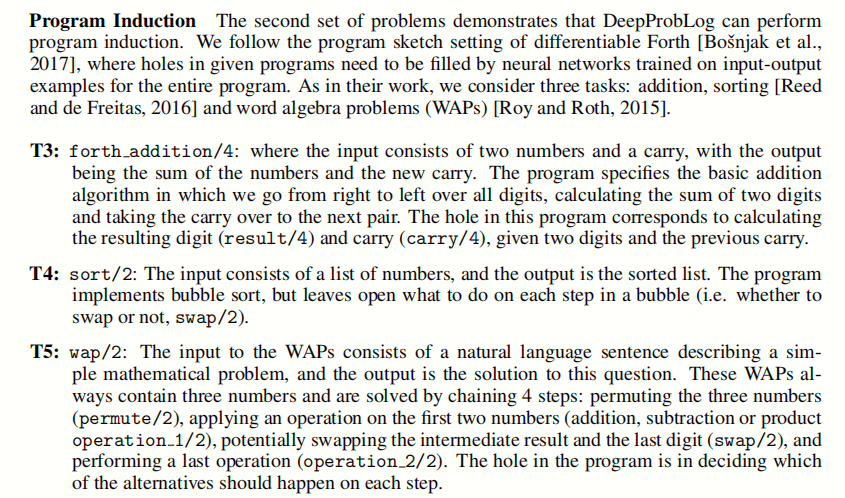
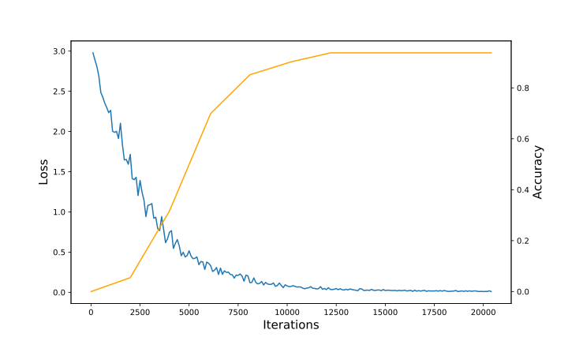
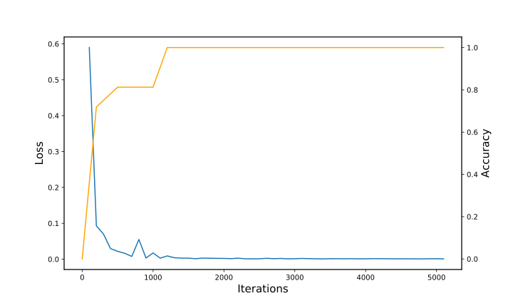
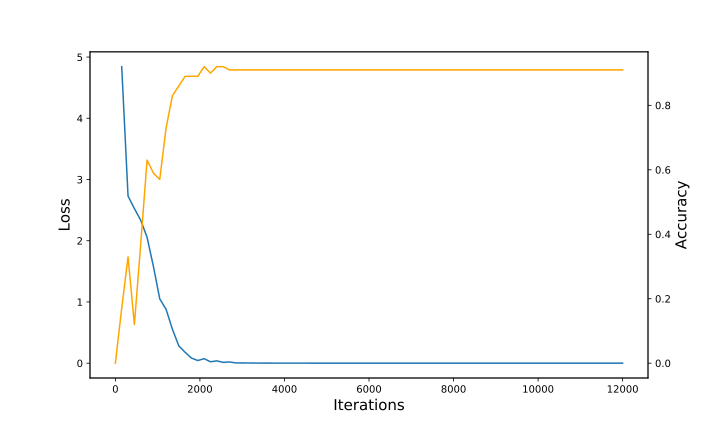

# 11.20 报告

小组成员: 华思远, 李国祥

所选题目:Task2(ReDoPaper), DeepProbLog: Neural Probabilistic Logic Programming

------

在此前完成了论文当中所提到的`Baseline`, `Single Digit`， `Multi Digits`实现. 此后我们重现了论文的另外三个实验: `forth_addition`， `sort`, 和`wap`



以上三个实验都是在一定的输入输出下训练的, 作者分别训练了自己的模型并得出了测试的结果.

1 `forth_addition`， 目录在`examples/NIPS/Forth/Add/`下, 训练测试命令为

```shell
python run.py
```

输入为两个数和上一位的进位, 输出为计算结果和向下一位的进位. 这一部分, `examples/NIPS/Forth/Add/data/`目录下训练测试样例为:

```python

add(
    [8],
	[4],
	 1,
  [1,3]
).

add(
	[8,7,9],
    [7,4,1],
         1,
  [1,6,2,1]
).
  
add(
  [1,4,7,1,1,3,0,2,0,8,3,0,0,9,1,3,0,7,6,0,7,7,0,1,0,3,8,0,3,7,7,4],					   [9,3,5,9,3,1,6,1,1,9,7,4,9,2,2,7,3,2,8,4,0,8,4,1,0,8,3,8,0,9,1,8],
                                                                 1,
[1,0,8,3,0,4,4,6,3,2,8,0,5,0,1,4,0,4,0,4,4,8,5,4,2,1,2,1,8,4,6,9,3]
).
```

`ProbLog`语句如下:

```makefile
nn(neural1,[I1,I2,Carry],O,[0,1,2,3,4,5,6,7,8,9]) :: neural1(I1,I2,Carry,O).
nn(neural2,[I1,I2,Carry],NewCarry,[0,1]) :: neural2(I1,I2,Carry,NewCarry).


slot(I1,I2,Carry,Carry2,O) :-
    neural1(I1,I2,Carry,O),
    neural2(I1,I2,Carry,Carry2).

add([],[],C,C,[]).

add([H1|T1],[H2|T2],C,Carry,[Digit|Res]) :-
    add(T1,T2,C,Carry2,Res),
    slot(H1,H2,Carry2,Carry,Digit).

add(L1,L2,C,[Carry|Res]) :- add(L1,L2,C,Carry,Res).
```

1.1 前两条规则是神经谓词,  用到2个神经网络形成两个谓词结构.

`neural1`为计算当前位结果的谓词, 输入为3个数:本位的两个加数`I1`,`I2`和前一位的进位`Carry`, 输出本位加法的结果`O`.

`neural2`为计算向前进位结果的谓词, 输入为和`neural1`相同的3个数, 输出为向前一位的进位`NewCarry`.

这部分用到的2个神经网络是一个纯粹的分类器. 以上2个神经网络分别的结构如下:

```python
# neural1
nn.Linear(30, 25)
nn.ReLU()
nn.Linear(25, 10)
nn.Softmax(1)

# neural2
nn.Linear(30, 5)
nn.ReLU()
nn.Linear(5, 2)
nn.Softmax(1)
```

输入均为一个长为30的数组, `neural1`的输出为一个长为10的数组, `neural2`的输出为一个长为2的数组, 分别代表了两个神经网络的分类结果. 

1.2 第3条规则`slot`将上面两个神经谓词结合了起来, 形成了对一位的完整的加法功能.

1.3 后面3条规则将论文当中要实现的功能封装为`add`谓词, 其中用到了递归的思想, 递归到前一位进位的数位结束.

1.4 实验结果: 论文当中没有贴出训练时`Loss`和`Accuracy`的曲线图, 我们训练测试的结果为:



最终准确率并没有达到论文中所提到的100%, 多次测试最好的结果是在93%左右. 并且改变神经网络的中间结构对结果影响不大, 都不能达到100%.

------

2 `sort`, 目录在`examples/NIPS/Forth/Sort/`下, 训练测试命令为

```python
python run.py
```

这里的`sort`实际上是快排, 对一连串从0到9的数字进行排序, `examples/NIPS/Forth/Add/data/`下的训练测试数据为

```python
forth_sort(
	[5, 3],
	[3, 5]
).

forth_sort(
	[2, 2, 5, 7, 6, 0, 4, 8],
	[0, 2, 2, 4, 5, 6, 7, 8]
).

forth_sort(
	[0, 6, 3, 4, 8, 1, 4, 0, 2, 3, 9, 7, 6, 9, 8, 8, 7, 3, 9, 4, 0, 1, 3, 1, 4, 6, 2, 2, 4, 0, 8, 8, 3, 7, 4, 4, 3, 3, 1, 3, 9, 4, 5, 8, 6, 0, 1, 4, 8, 7, 7, 3, 0, 8, 0, 9, 6, 6, 0, 8, 6, 9, 1, 9],
	[0, 0, 0, 0, 0, 0, 0, 0, 1, 1, 1, 1, 1, 1, 2, 2, 2, 3, 3, 3, 3, 3, 3, 3, 3, 3, 4, 4, 4, 4, 4, 4, 4, 4, 4, 5, 6, 6, 6, 6, 6, 6, 6, 7, 7, 7, 7, 7, 8, 8, 8, 8, 8, 8, 8, 8, 8, 9, 9, 9, 9, 9, 9, 9]
).
```

`ProBlog`的语句如下:

```makefile
nn(swap_net, [X,Y],Z,[no_swap, swap]) :: swap(X,Y,Z).

quicksort([X|Xs],Ys) :-
  partition(Xs,X,Left,Right),
  quicksort(Left,Ls),
  quicksort(Right,Rs),
  append(Ls,[X|Rs],Ys).
  
quicksort([],[]).

partition([X|Xs],Y,[X|Ls],Rs) :-
  swap(X,Y,swap), partition(Xs,Y,Ls,Rs).
partition([X|Xs],Y,Ls,[X|Rs]) :-
  swap(X,Y,no_swap), partition(Xs,Y,Ls,Rs).
  
partition([],Y,[],[]).

append([],Ys,Ys).
append([X|Xs],Ys,[X|Zs]) :- append(Xs,Ys,Zs).

forth_sort(L,L2) :- quicksort(L,L2).
```

2.1 第一条规则为神经谓词输入为两个数, 输出为是否交换. 这部分的神经网络结构如下所示:

```python
#swap_net
nn.Linear(20, 2)
nn.Softmax(1)
```

相当于一个2分类“是否交换”.

2.2 剩下的规则是在对快排做逻辑定义. 其中也是用到了递归求解的思路, 和用其他语言写快排是类似的.

2.3 实验结果: 以下为`Loss`和`Accuracy`的变化曲线图.



可见收敛速度还是很快的, 最终`Loss`趋近于0, 而`Accuray`变成了100%. 这和论文中的结果是一致的.

最后可能尝试使用更简单的如冒泡排序逻辑实现`Sort`. 不过可能并没有这么简单, 由于快排可以表示为递归, 可以用逻辑上的一系列依赖关系表示, 而冒泡排序需要用循环表示.

3  `wap` 目录在`examples/NIPS/Forth/Wap/`下, 训练测试命令为

```python
python run.py
```

输入是一个句子, 描述了一个简单的数学问题, 这个数学问题当中有3个数, 输出是对这个问题的解答. 训练测试的样例在`examples/NIPS/Forth/Wap/data/`下.

```python
wap("A pet store had 13 siamese cats and 5 house cats . During a sale they sold 10 cats . How many cats do they have left ?",13,5,10,8).

wap("For Halloween Debby and her sister combined the candy they received . Debby had 32 pieces of candy while her sister had 42 . If they ate 35 pieces the first night , how many pieces do they have left ?",32,42,35,39).
```

这部分的`ProbLog`语句如下:

```makefile
nn(nn_permute, [X],Y,[0,1,2,3,4,5]) :: net1(X,Y).
nn(nn_op1, [X],Y, [plus,minus,times,div]) :: net2(X,Y).
nn(nn_swap, [X],Y, [no_swap,swap]) :: net3(X,Y).
nn(nn_op2, [X],Y, [plus,minus,times,div]) :: net4(X,Y).

permute(0,A,B,C,A,B,C).
permute(1,A,B,C,A,C,B).
permute(2,A,B,C,B,A,C).
permute(3,A,B,C,B,C,A).
permute(4,A,B,C,C,A,B).
permute(5,A,B,C,C,B,A).


swap(no_swap,X,Y,X,Y).
swap(swap,X,Y,Y,X).

operator(plus,X,Y,Z) :- Z is X+Y.
operator(minus,X,Y,Z) :- Z is X-Y.
operator(times,X,Y,Z) :- Z is X*Y.
operator(div,X,Y,Z) :- Y > 0, 0 =:= X mod Y,Z is X//Y.

wap(Repr,X1,X2,X3,Out) :-
    net1(Repr,Perm),
    permute(Perm,X1,X2,X3,N1,N2,N3),
    net2(Repr,Op1),
    operator(Op1,N1,N2,Res1),
    net3(Repr,Swap),
    swap(Swap,Res1,N3,X,Y),
    net4(Repr,Op2),
    operator(Op2,X,Y,Out).
```

可见作者解决问题的思路也比较简单,

i. 	先用神经网络训练得出问题当中3个数的一个排列

ii.	对上面排列的结果的前2个数进行一次或加或减或乘或除的运算, 用神经网络去预测运算的类型.

iii.	用神经网络判定上面的这个结果和最后一个数的位置是不是需要互换

iv. 	对最后的这两个数进行一次或加或减或乘或除的运算, 用神经网络去预测运算的类型. 运算的结果就是最终的结果.

以上的所有神经网络是基于`RNN`将文本信息转化为一个长为600的一维向量. 这个`RNN`网络并没有在上面的`ProbLog`语句当中体现出来. 这里的`RNN`在论文给出的代码实现上是一个双向`LSTM`网络(Long Short-Term Memory, 长短期记忆网络), 所以输出的长度为75*2. 以上4步所用到的神经网络的输入便是这个长为600的一维向量, 输出分别为选取哪一种排列/是否交换/选取哪一种运算符.

```python
# RNN
class RNN(nn.Module):
    def __init__(self,vocab_size,hidden_size):
        super(RNN, self).__init__()
        self.lstm = nn.LSTM(vocab_size,hidden_size,1,bidirectional=True)

    def forward(self, x,n1,n2,n3):
        x ,_ = self.lstm(x)
        x = torch.cat((x[-1,...],x[n1,...],x[n2,...],x[n3,...]),1)
        x.view(1,-1)
        return x

# len(vocab) == 1492
rnn = RNN(len(vocab),75)

# net_permute
nn.Linear(600, 6)
nn.Softmax(1)

# net_op1
nn.Linear(600, 4)
nn.Softmax(1)

# net_swap
nn.Linear(600, 2)
nn.Softmax(1)

# net_op2
nn.Linear(600, 4)
nn.Softmax(1)
```

实验结果: `Loss`和`Accuracy`随迭代次数变化的趋势如下:



同样是很快地收敛了, 实验设置的迭代次数显得有点多(`Loss`很快趋近于0, 这时候模型已经达到了最优).

最终准确率是达到了92%, 

可能考虑将其中的`RNN`模型更换别的一些`RNN`模型, 看会不会获得更好的训练效果.

------

## 之后的一些工作

尝试:`Sort`使用冒泡排序的逻辑实现并验证

`Wap`中使用不同的`RNN`, 对比实验结果

做完最后一个实验`example/CoinUrn`

重新构建一下代码, 在原始的代码中, 进行不同的实验需要进入各个目录底下, 并且命令行只有`python run.py`这一种, 一些参数的调整需要进入到代码当中. 我们希望能直接在主目录底下实现训练和测试， 通过改变命令行参数的方式来进行不同的实验.

