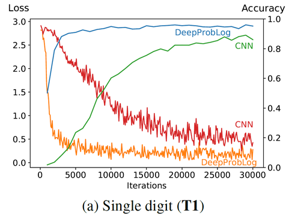
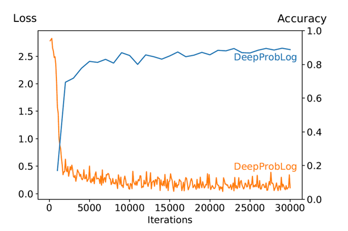
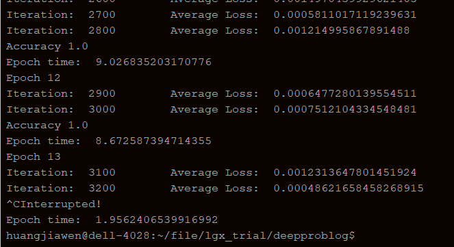

## 12.18报告

小组成员：华思远，李国祥

所选题目：Task2(ReDoPaper), DeepProbLog: Neural Probabilistic Logic Programming

---

最后一次报告回顾了整篇论文以及我的工作。


### 论文回顾

传统的深度学习利用神经网络学习数据中的知识，如何表示数据以及发掘数据间联系的任务由神经网络完成。本篇论文提出了结合神经网络和逻辑推理语言`prolog`的`deepprolog`，能够利用逻辑推理中引入的知识提高神经网络预测的精度，同时具有很好的泛化性，能够解决单存依靠神经网络所无法解决的问题。

#### 我的工作

完成了四个实验，分别是`MNIST`手写体识别并求和的`baseline`，使用`Deeproblog`的`Single digit`和`Multi digit` ，以及`bubble sort`。

- Baseline

  利用`CNN`模型识别手写体并求和，训练数据是两种手写体图片并打上了对应和的标签，试验结果如下

  

- Single digit

  使用CNN模型识别手写体图片，可以给出图片对应0~9的概率，基于CNN网络得到神经谓词，再与求和的语句组成手写体识别并求和的子句。

  ```
  nn(mnist_net,[X],Y,[0,1,2,3,4,5,6,7,8,9]) :: digit(X,Y).
  addition(X,Y,Z) :- digit(X,X2), digit(Y,Y2), Z is X2+Y2.
  ```

  第一句使用`mnist_net`建立神经谓词，给出一个手写体图片`X`对应数字`0~9`的概率，第二个子句把识别手写体图片的语句`digit(X,X2)`和求和语句`Z is X2+Y2`结合组成子句，可以给出一个命题`X+Y=Z`的概率。

  测试结果如下：

  

  论文的结果如下：

  

  从图中可以看出`DeepProbLog`预测的精度优于`CNN`。

- Multi digit

  两张手写体图片组成一个输入向量，代表一个两位数。给定两个输入向量，代表两个两位数，求出这两个两位数的和。

  ```
  nn(mnist_net,[X],Y,[0,1,2,3,4,5,6,7,8,9]) :: digit(X,Y).
  
  number([],Result,Result).
  number([H|T],Acc,Result) :- digit(H,Nr), Acc2 is Nr+10*Acc,number(T,Acc2,Result).
  number(X,Y) :- number(X,0,Y).
  addition(X,Y,Z) :- number(X,X2), number(Y,Y2), Z is X2+Y2.
  ```

  第一行与Single digit中一样，使用CNN网络建立一个神经谓词，给出某个手写体图片对应数字`0~9`的概率。`number(X,Y)`表示手写体图片`X`对应的数字为`Y`，这个语句的实现逻辑是：一个两位数是由高位部分乘以10加上低位部分得到的。

  测试结果如下：

  

  论文的结果如下：

  

  CNN模型无法用于识别四张手写体图片表示的两个两位数后求二者的和，和CNN相比DeepProblog具有很好的泛化能力。

- bubble sort

  代码如下：

  ```
  nn(swap_net, [X,Y],Z,[no_swap, swap]) :: swap(X,Y,Z).
  
  hole(X,Y,X,Y):-
      swap(X,Y,no_swap).
  
  hole(X,Y,Y,X):-
      swap(X,Y,swap).
  
  bubble([X],[],X).
  bubble([H1,H2|T],[X1|T1],X):-
      hole(H1,H2,X1,X2),
      bubble([X2|T],T1,X).
  
  bubblesort([],L,L).
  
  bubblesort(L,L3,Sorted) :-
      bubble(L,L2,X),
      bubblesort(L2,[X|L3],Sorted).
  
  forth_sort(L,L2) :- bubblesort(L,[],L2).
  ```

  第一行声明了一个判断两个元素是否要交换的神经谓词，第`3~7`行根据两个元素是否要交换决定是否把两个元素在数组中的位置交换。`bubble`谓词用于选择一个起泡元素，`bubblesort`用于把一个元素放入未排序部分的合适位置。

  测试结果如下：

  3200次迭代后的平均损失已经接近于0，与论文中所写的精度100%一致。

  

  