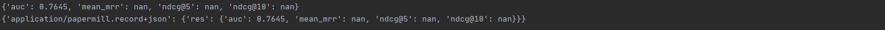

# 基于内容的新闻推荐—DKN算法实践

[TOC]


## 推荐系统及算法简介

### 推荐系统概述

在这个时代，无论是信息消费者还是信息生产者都遇到了很大的挑战:作为信息消费者，如何从大量信息中找到自己感兴趣的信息是一件非常困难的事情;作为信息生产者， 如何让自己生产的信息脱颖而出，受到广大用户的关注，也是一件非常困难的事情。推荐系统就是解决这一矛盾的重要工具。推荐系统的任务就是联系用户和信息，一方面帮助用户发现对自己有价值的信息，另一方面让信息能够展现在对它感兴趣的用户面前，从而实现信息消费者和信息 生产者的双赢。

和搜索引擎不同的是，推荐系统不需要用户提供明确的需求，而是通过分析用户的历史行为给用 户的兴趣建模，从而主动给用户推荐能够满足他们兴趣和需求的信息。


### 推荐算法概述

#### 协同过滤推荐

协调过滤是推荐算法中目前最主流的种类，花样繁多，在工业界已经有了很多广泛的应用。它的优点是**不需要太多特定领域的知识，可以通过基于统计的机器学习算法来得到较好的推荐效果**。最大的优点是工程上容易实现，可以方便应用到产品中。目前绝大多数实际应用的推荐算法都是协同过滤推荐算法。


#### 混合推荐

这个类似机器学习中的集成学习，博才众长，通过多个推荐算法的结合，得到一个更好的推荐算法，起到三个臭皮匠顶一个诸葛亮的作用。比如通过建立多个推荐算法的模型，最后用投票法决定最终的推荐结果。


#### 基于规则的推荐

这类算法常见的比如**基于最多用户点击，最多用户浏览**等，属于大众型的推荐方法，在目前的大数据时代并不主流。


#### 基于人口信息的推荐

这一类是最简单的推荐算法了，它只是简单的根据系统用户的基本信息发现用户的相关程度，然后进行推荐，目前在大型系统中已经较少使用。


#### 基于内容的推荐

这一类一般**依赖于自然语言处理NLP的一些知识，通过挖掘文本的TF-IDF特征向量，来得到用户的偏好**，进而做推荐。这类推荐算法可以找到用户独特的小众喜好，而且还有**较好的解释性**。


## DKN算法简介

DKN算法是一种基于内容的新闻推荐算法。本次实验是目标在于完成DKN算法的搭建。


### 问题定义

新闻标题和正文中通常存在大量的实体，实体间的语义关系可以有效地扩展用户兴趣。然而这种语义关系难以被传统方法（话题模型、词向量）发掘。

对于一个给定的用户user~i~，他的点击历史t = {W~1~，W~2~，……，W~n~}，记为是该用户过去一段时间内曾点击过的新闻的标题，N代表用户点击过的新闻的总数。每个标题都是一个词序列，标题中的单词有的对应知识图谱中的一个实体。举例来说，标题《Trump praises Las Vegas medical team》其中Trump与知识图谱中的实体“Donald Trump”对应，Las和Vegas与实体Las Vegas对应。本文要解决的问题就是给定用户的点击历史，以及标题单词和知识图谱中实体的关联，要预测的是：一个用户i是否会点击一个特定的新闻t~j~。


### DKN模型


上图为DKN模型算法流程图，我们将在下面详细介绍此模型。

DKN的网络输入有两个：候选新闻集合，用户点击过的新闻标题序列。输入数据通过KCNN来提取特征，之上是一个attention层，计算候选新闻向量与用户点击历史向量之间的attention权重，在顶层拼接两部分向量之后，用DNN计算用户点击此新闻的概率。


#### KCNN

##### 简介

Kim CNN，用句子所包含词的词向量组成的二维矩阵，经过一层卷积操作之后再做一次max-over-time的pooling操作得到句子向量。
三种向量**词向量、实体向量、上下文向量**（实体第一层的关联实体的向量），简单的concat，然后通过两种不同size的卷积池化，再将两种size的结果concat。

（１）输入层
如图所示，输入层是句子中的词语对应的wordvector依次排列的矩阵，假设句子有 n 个词，vector的维数为  k  ，那么这个矩阵就是  n × k 的(在CNN中可以看作一副高度为n、宽度为k的图像)。

（２）第一层卷积
输入层通过卷积操作得到若干个Feature Map，卷积窗口的大小为 h ×k ，其中 h  表示纵向词语的个数，而  k  表示word vector的维数。通过这样一个大型的卷积窗口，将得到若干个列数为1的Feature Map。

（３）池化层
接下来的池化层，文中用了一种称为Max-over-time Pooling的方法。这种方法就是简单地从之前一维的Feature Map中提出最大的值，文中解释最大值代表着最重要的信号。可以看出，这种Pooling方式可以解决可变长度的句子输入问题（因为不管Feature Map中有多少个值，只需要提取其中的最大值）。最终池化层的输出为各个Feature Map的最大值们，即一个一维的向量。

##### 具体操作：输入新闻向量（实体+单词）

1、变换：实体向量与上下文向量经过同一个变换，映射到同一线性空间。线性变换/非线性变换？

参数选取w？ b? 是否需要优化？

2、（w1,w2,...,wn,e1,e2,...,en)

3、一个卷积块：多次（这里是3次)不同大小的卷积核卷积，经过relu转换，加入池化层，最后对所有的池化结果连接(concat)并flat。(输出)


#### Attention

##### 简介

简单来说，就是一种权重参数的分配机制，目标是协助模型捕捉重要信息。具体一点就是，给定一组<key,value>，以及一个目标（查询）向量query，attention机制就是通过计算query与每一组key的相似性，得到每个key的权重系数，再通过对value加权求和，得到最终attention数值。
获取到用户点击过的每篇新闻的向量表示以后，计算候选文档对于用户每篇点击文档的attention，再做加权求和，计算attention。

##### 具体操作

1、获取用户点击历史新闻和候选新闻的kcnn特征

2、在判断用户对当前新闻的兴趣时，使用注意力网络（[attention network](https://blog.csdn.net/weixin_36474809/article/details/89401552)）给用户历史记录分配不同的权重。通过softmax函数得到归一化的权重。

在这里，我们用到了一个batch_bomalnization。

batch_normalization：①不仅仅极大提升了训练速度，收敛过程大大加快；②还能增加分类效果，一种解释是这是类似于Dropout的一种防止过拟合的正则化表达方式，所以不用Dropout也能达到相当的效果；③另外调参过程也简单多了，对于初始化要求没那么高，而且可以使用大的学习率等

思想：因为深层神经网络在做非线性变换前的**激活输入值**（就是那个x=WU+B，U是输入）**随着网络深度加深或者在训练过程中，其分布逐渐发生偏移或者变动，之所以训练收敛慢，一般是整体分布逐渐往非线性函数的取值区间的上下限两端靠近**（对于Sigmoid函数来说，意味着激活输入值WU+B是大的负值或正值），所以这**导致反向传播时低层神经网络的梯度消失**，这是训练深层神经网络收敛越来越慢的**本质原因**，**而BN就是通过一定的规范化手段，把每层神经网络任意神经元这个输入值的分布强行拉回到均值为0方差为1的标准正态分布**，其实就是把越来越偏的分布强制拉回比较标准的分布，这样使得激活输入值落在非线性函数对输入比较敏感的区域，这样输入的小变化就会导致损失函数较大的变化，意思是**这样让梯度变大，避免梯度消失问题产生，而且梯度变大意味着学习收敛速度快，能大大加快训练速度。**[详细介绍](https://www.cnblogs.com/guoyaohua/p/8724433.html)

3、输出：用户的嵌入 + 候选新闻嵌入


#### DNN

##### 简介

DNN（多层感知机模型）：通过多层全连接层训练，输入attention层输出向量，输出得分。

##### 具体操作

1、随机初始化方法：

Xavier随机初始化 [1]。假设某全连接层的输⼊个数为a，输出个数为b， Xavier随机初始化将使该层中权重参数的每个元素都随机采样于均匀分布  
$$
U(-\sqrt{6/(a+b)}, \sqrt{6/(a+b)})
$$
它的设计主要考虑到，模型参数初始化后，每层输出的⽅差不该受该层输⼊个数影响，且每层梯度的⽅差也不该受该层输出个数影响。  

[详细介绍](https://zhuanlan.zhihu.com/p/138064188)

2、丢弃率：防止模型过拟合，效果上呈现为随机丢弃一些计算单元

训练时设定一定的数值

测试时一般设为0，便于得到较好的结果。

[详细介绍](https://blog.csdn.net/program_developer/article/details/80737724)

3、设定优化方法：

adam、adgrad、Gradient Descent、Newton、Momentum……

[详细介绍](https://www.jianshu.com/p/795af312a422)

4、损失函数：数据损失 + 正则化

数据损失：表达预测值与真实值之间的差异: log loss, square loss, cross entropy loss

正则化：给模型加一些规则限制，约束要优化参数，目的是防止过拟合。其中最常见的规则限制就是添加先验约束，其中L1相当于添加Laplace先验，L2相当于添加Gaussian先验。

此次添加的正则化中，有对输入的单词/实体向量的l1 + l2正则化，还有对整个网络上的参数的l1 + l2正则化。

5、分类器常用评测指标：

**auc**（Area Under Curve）被定义为ROC曲线下的面积。我们往往使用AUC值作为模型的评价标准是因为很多时候ROC曲线并不能清晰的说明哪个分类器的效果更好，而作为一个数值，对应AUC更大的分类器效果更好

**NDCG**，Normalized Discounted Cumulative Gain , 归一化折损累计增益，是一种考虑了结果相关性和顺序因素的评价指标，可用于多分类问题评价。它的核心思想：
1.高关联度的结果比一般关联度的结果更影响最终的指标得分；
2.有高关联度的结果出现在更靠前的位置的时候，指标会越高。

[详细介绍](https://www.cnblogs.com/chason95/articles/10670761.html)


### 训练过程

1、获取数据（batch训练方式）：一条数据组成是由对于某用户一次行为对某条新闻（候选新闻）的点击状态（1/0）+ 该用户点击过的新闻（用户历史行为）单词向量序号 + 历史点击新闻实体向量序号 + 候选新闻单词向量序号 + 候选新闻实体向量序号。作为feed_dict输入

2、利用已搭建的网络，依次训练。每一个训练周期过后利用评测数据评价到目前为止的准确率。


## DKN算法实现

### 数据预处理

文件：data_preprocess.py

#### 1、数据描述

MIND数据集包含用户浏览历史新闻和新闻数据+用户在历史推荐的的新闻候选集中的点击意愿。我们使用了大小152MB大小的数据集，是MIND数据集中最小的一个示例，数据量较小，便于我们训练观察。

详细数据描述：


#### 2、数据清洗

提取出模型所需的训练数据

```python
def clean_dataset(behaviors_source, behaviors_target, news_source,
                  news_target):
    print(f"Clean up {behaviors_source}")
    behaviors = pd.read_table(behaviors_source,
                              header=None,
                              usecols=[3, 4],
                              names=['clicked_news', 'impressions'])
    behaviors.impressions = behaviors.impressions.str.split()
    behaviors = behaviors.explode('impressions').reset_index(drop=True)
    behaviors['candidate_news'], behaviors[
        'clicked'] = behaviors.impressions.str.split('-').str
    behaviors.clicked_news.fillna('', inplace=True)
    behaviors.to_csv(behaviors_target,
                     sep='\t',
                     index=False,
                     columns=['clicked_news', 'candidate_news', 'clicked'])

    print(f"Clean up {news_source}")
    news = pd.read_table(news_source,
                         header=None,
                         usecols=[0, 3, 6],
                         names=['id', 'title', 'entities'])
    news.to_csv(news_target, sep='\t', index=False)
```


#### 3、数据平衡

历史推荐的的新闻候选集中训练数据中发现正负样本不均——负例样本远多于整理样本，我们采用了欠采样技术。

```python
def balance(source, target, true_false_division_range):
    """
    Args:
        source: file path of original behaviors tsv file
        target: file path of balanced behaviors tsv file
        true_false_division_range: (low, high), len(true_part) / len(false_part) will be within the range
    """
    low = true_false_division_range[0]
    high = true_false_division_range[1]
    assert low <= high
    original = pd.read_table(source)
    true_part = original[original['clicked'] == 1]
    false_part = original[original['clicked'] == 0]
    if len(true_part) / len(false_part) < low:
        print(
            f'Drop {len(false_part) - int(len(true_part) / low)} from false part'
        )
        false_part = false_part.sample(n=int(len(true_part) / low))
    elif len(true_part) / len(false_part) > high:
        print(
            f'Drop {len(true_part) - int(len(false_part) * high)} from true part'
        )
        true_part = true_part.sample(n=int(len(false_part) * high))

    balanced = pd.concat([true_part,
                          false_part]).sample(frac=1).reset_index(drop=True)
    balanced.to_csv(target, sep='\t', index=False)
```


#### 4、新闻解析

单词、实体，在整个训练集中，我们认为，应该讲出现次数过少的单词/实体过滤掉，理由是：避免偶然性影响新闻特征的提取。对于实体，我们以其置信度加和作为出现频率。同时对于每一条新闻的单词、实体嵌入，我们进行了编号，便于后面对相应单词实体进行索引。

```python
def parse_news(source, target, word2int_path, entity2int_path, mode):
		word2int = {}
        word2freq = {}
        entity2int = {}
        entity2freq = {}

        news = pd.read_table(source)
        news.entities.fillna('[]', inplace=True)
        parsed_news = pd.DataFrame(columns=['id', 'title', 'entities'])

        with tqdm(total=len(news), desc="Counting words and entities") as pbar:
            for row in news.itertuples(index=False):
                for w in clean_text(row.title).split():
                    if w not in word2freq:
                        word2freq[w] = 1
                    else:
                        word2freq[w] += 1
                for e in json.loads(row.entities):
                    # Count occurrence time within title
                    times = len(
                        list(
                            filter(lambda x: x < len(row.title),
                                   e['OccurrenceOffsets']))) * e['Confidence']
                    if times > 0:
                        if e['WikidataId'] not in entity2freq:
                            entity2freq[e['WikidataId']] = times
                        else:
                            entity2freq[e['WikidataId']] += times
                pbar.update(1)

        for k, v in word2freq.items():
            if v >= Config.word_freq_threshold:
                word2int[k] = len(word2int) + 1

        for k, v in entity2freq.items():
            if v >= Config.entity_freq_threshold:
                entity2int[k] = len(entity2int) + 1

        with tqdm(total=len(news), desc="Parsing words and entities") as pbar:
            for row in news.itertuples(index=False):
                new_row = [
                    row.id, [0] * Config.num_words_a_news,
                    [0] * Config.num_words_a_news
                ]

                # Calculate local entity map (map lower single word to entity)
                local_entity_map = {}
                for e in json.loads(row.entities):
                    if e['Confidence'] > Config.entity_confidence_threshold and e[
                            'WikidataId'] in entity2int:
                        for x in ' '.join(e['SurfaceForms']).lower().split():
                            local_entity_map[x] = entity2int[e['WikidataId']]
                try:
                    for i, w in enumerate(clean_text(row.title).split()):
                        if w in word2int:
                            new_row[1][i] = word2int[w]
                            if w in local_entity_map:
                                new_row[2][i] = local_entity_map[w]
                except IndexError:
                    pass

                parsed_news.loc[len(parsed_news)] = new_row

                pbar.update(1)

        parsed_news.to_csv(target, sep='\t', index=False)
        pd.DataFrame(word2int.items(), columns=['word',
                                                'int']).to_csv(word2int_path,
                                                               sep='\t',
                                                               index=False)
        print(
            f'Please modify `num_word_tokens` in `src/config.py` into 1 + {len(word2int)}'
        )
        pd.DataFrame(entity2int.items(),
                     columns=['entity', 'int']).to_csv(entity2int_path,
                                                       sep='\t',
                                                       index=False)
```


5、将相应向量按照序号存入文件，这样训练集变得有序，便于数据装载时索引提取。同时避免存储重复数据。同时我们发现某些新闻的实体嵌入缺失，做0填充。

```python
def transform_entity_embedding(source, target, entity2int_path):
    """
    Args:
        source: path of embedding file
            example:
                Q100   -0.075855  -0.164252  0.128812   -0.022738  -0.127613  ...
        target: path of transformed embedding file in numpy format
        entity2int_path
    """
    entity_embedding = pd.read_table(source, header=None)
    entity_embedding['vector'] = entity_embedding.iloc[:, 1:101].values.tolist()
    entity_embedding = entity_embedding[[0, 'vector']].rename(columns={0: "entity"})

    entity2int = pd.read_table(entity2int_path)
    merged_df = pd.merge(entity_embedding, entity2int, on='entity').sort_values('int')
    # some entity in entity2int cannot be found in entity_embedding
    entity_embedding_transformed = np.zeros((len(entity2int) + 1, Config.entity_embedding_dim))
    for row in merged_df.itertuples(index=False):
        entity_embedding_transformed[row.int] = row.vector
    np.save(target, entity_embedding_transformed)
```


### 模型构建

文件位置：model文件夹

#### KCNN

KCNN模型是一个利用已有知识，提取文档特征的卷积网络。

1、输入新闻向量（实体+单词）

1、变换：实体向量与上下文向量经过同一个变换，映射到与单词嵌入相同的同一线性空间。可以是线性变换，也可以是非线性变换，这里我们采用非线性变换。

2、将变换后的实体与单词拼接（w~1~,w~2~,...,w~n~ , e~1~,e~2~,...,e~n~)。

3、一个卷积块：多次（这里是3次)不同大小的卷积核卷积，经过relu转换，加入池化层，最后对所有的池化结果连接(concat)得到新闻的特征向量。

kcnn.py:

```python
class KCNN(torch.nn.Module):
    """
    Knowledge-aware CNN (KCNN) based on Kim CNN.
    Input a news sentence (e.g. its title), produce its embedding vector.
    """
    def __init__(self, config, word_embedding, entity_embedding):
        super(KCNN, self).__init__()
        self.config = config
        self.word_embedding = word_embedding
        self.entity_embedding = entity_embedding
        self.transform_matrix = nn.Parameter(
            torch.empty(self.config.word_embedding_dim,
                        self.config.entity_embedding_dim))
        self.transform_bias = nn.Parameter(
            torch.empty(self.config.word_embedding_dim))

        self.conv_filters = nn.ModuleDict({
            str(x): nn.Conv2d(2, self.config.num_filters,
                              (x, self.config.word_embedding_dim))
            for x in self.config.window_sizes
        })

        self.transform_matrix.data.uniform_(-0.1, 0.1)
        self.transform_bias.data.uniform_(-0.1, 0.1)

    def forward(self, news):
        """
        Args:
          news:
            {
                "word": [Tensor(batch_size) * num_words_a_news],
                "entity":[Tensor(batch_size) * num_words_a_news]
            }
        Returns:
          final_vector: batch_size, len(window_sizes) * num_filters
        """
        word_vector = F.embedding(
            torch.stack(news["word"], dim=1),
            torch.from_numpy(self.word_embedding)).float().to(device)
        entity_vector = F.embedding(
            torch.stack(news["entity"], dim=1),
            torch.from_numpy(self.entity_embedding)).float().to(device)

        # The abbreviations are the same as those in paper
        b = self.config.batch_size
        n = self.config.num_words_a_news
        d = self.config.word_embedding_dim
        k = self.config.entity_embedding_dim

        # batch_size, num_words_a_news, word_embedding_dim
        transformed_entity_vector = torch.tanh(
            torch.add(
                torch.bmm(self.transform_matrix.expand(b * n, -1, -1),
                          entity_vector.view(b * n, k, 1)).view(b, n, d),
                self.transform_bias.expand(b, n, -1)))

        multi_channel_vector = torch.stack(
            [word_vector, transformed_entity_vector], dim=1)

        pooled_vectors = []
        for x in self.config.window_sizes:
            # batch_size, num_filters, num_words_a_news + 1 - x
            convoluted = self.conv_filters[str(x)](
                multi_channel_vector).squeeze(dim=3)
            # batch_size, num_filters, num_words_a_news + 1 - x
            activated = F.relu(convoluted)
            # batch_size, num_filters
            pooled = activated.max(dim=-1)[0]
            pooled_vectors.append(pooled)
        # batch_size, len(window_sizes) * num_filters
        final_vector = torch.cat(pooled_vectors, dim=1)
        return final_vector
```


#### attention

1、获取用户点击历史新闻和候选新闻的kcnn特征

2、在判断用户对当前新闻的兴趣时，使用注意力网络（[attention network](https://blog.csdn.net/weixin_36474809/article/details/89401552)）给用户历史记录分配不同的权重。通过softmax函数得到归一化的权重。

3、输出：用户的嵌入

attention.py

```python
class Attention(torch.nn.Module):
    """
    Attention Net.
    Input embedding vectors (produced by KCNN) of a candidate news and all of user's clicked news,
    produce final user embedding vectors with respect to the candidate news.
    """

    def __init__(self, config):
        super(Attention, self).__init__()
        self.config = config
        self.dnn = nn.Sequential(
            nn.Linear(
                len(self.config.window_sizes) * 2 * self.config.num_filters,
                16), nn.Linear(16, 1))

    def forward(self, candidate_news_vector, clicked_news_vector):
        """
        Args:
          candidate_news_vector: batch_size, len(window_sizes) * num_filters
          clicked_news_vector: num_clicked_news_a_user, batch_size, len(window_sizes) * num_filters
        Returns:
          user_vector: batch_size, len(window_sizes) * num_filters
        """
        # num_clicked_news_a_user, batch_size, len(window_sizes) * num_filters
        candidate_expanded = candidate_news_vector.expand(
            self.config.num_clicked_news_a_user, -1, -1)
        # batch_size, num_clicked_news_a_user
        clicked_news_weights = F.softmax(self.dnn(
            torch.cat((clicked_news_vector, candidate_expanded),
                      dim=-1)).squeeze(-1).transpose(0, 1),
            dim=1)

        # print(clicked_news_weights.max(dim=1))
        # batch_size, len(window_sizes) * num_filters
        user_vector = torch.bmm(clicked_news_weights.unsqueeze(1),
                                clicked_news_vector.transpose(0, 1)).squeeze(1)
        return user_vector
```


#### DKN

将user embedding和candidate news embedding进行连接，然后利用一个两层DNN网络输出点击候选新闻的概率。

```python
class DKN(torch.nn.Module):
    """
    Deep knowledge-aware network.
    Input a candidate news and a list of user clicked news, produce the click probability.
    """
    def __init__(self, config, word_embedding, entity_embedding):
        super(DKN, self).__init__()
        self.config = config
        self.kcnn = KCNN(config, word_embedding, entity_embedding)
        self.attention = Attention(config)

        self.dnn = nn.Sequential(
            nn.Linear(
                len(self.config.window_sizes) * 2 * self.config.num_filters,
                16), nn.Linear(16, 1))

    def forward(self, candidate_news, clicked_news):
        """
        Args:
          candidate_news:
            {
                "word": [Tensor(batch_size) * num_words_a_news],
                "entity":[Tensor(batch_size) * num_words_a_news]
            }
          clicked_news:
            [
                {
                    "word": [Tensor(batch_size) * num_words_a_news],
                    "entity":[Tensor(batch_size) * num_words_a_news]
                } * num_clicked_news_a_user
            ]
        Returns:
          click_probability: batch_size
        """
        # batch_size, len(window_sizes) * num_filters
        candidate_news_vector = self.kcnn(candidate_news)
        # num_clicked_news_a_user, batch_size, len(window_sizes) * num_filters
        clicked_news_vector = torch.stack([self.kcnn(x) for x in clicked_news])
        # batch_size, len(window_sizes) * num_filters

        user_vector = self.attention(candidate_news_vector,
                                     clicked_news_vector)
        # Sigmoid is done with BCEWithLogitsLoss
        # batch_size
        click_probability = self.dnn(torch.cat((user_vector, candidate_news_vector),
                                               dim=1)).squeeze(dim=1)
        return click_probability
```


### 模型训练

划分数据集成训练集和验证集，设置在一批数据后然后进行验证评测，并在一定数据后进行保存模型的一个checkPoint。

train.py

```python
def train():
    writer = SummaryWriter()
    if not os.path.exists('checkpoint'):
        os.makedirs('checkpoint')

    dataset = DKNDataset('../dataset/train/behaviors_cleaned.tsv',
                         '../dataset/train/news_with_entity.tsv')
    train_size = int(Config.train_validation_split[0] /
                     sum(Config.train_validation_split) * len(dataset))
    validation_size = len(dataset) - train_size
    train_dataset, val_dataset = random_split(dataset,
                                              (train_size, validation_size))
    print(
        f"Load training dataset with train size {len(train_dataset)} and validation size {len(val_dataset)}."
    )

    train_dataloader = iter(
        DataLoader(train_dataset,
                   batch_size=Config.batch_size,
                   shuffle=True,
                   num_workers=Config.num_workers,
                   drop_last=True))

    # Load trained embedding file
    # num_entity_tokens, entity_embedding_dim
    entity_embedding = np.load('../dataset/train/entity_embedding.npy')
    word_embedding = np.load('../dataset/train/word_embedding.npy')

    dkn = DKN(Config, word_embedding, entity_embedding).to(device)
    print(dkn)

    criterion = nn.BCEWithLogitsLoss(
        pos_weight=torch.tensor([23.7]).float().to(device))
    optimizer = torch.optim.Adam(dkn.parameters(), lr=Config.learning_rate)
    start_time = time.time()
    loss_full = []
    exhaustion_count = 0
    epoch = 0

    if Config.load_checkpoint:
        checkpoint_path = latest_checkpoint('./checkpoint')
        if checkpoint_path is not None:
            print(f"Load saved parameters in {checkpoint_path}")
            checkpoint = torch.load(checkpoint_path)
            dkn.load_state_dict(checkpoint['model_state_dict'])
            optimizer.load_state_dict(checkpoint['optimizer_state_dict'])
            epoch = checkpoint['epoch']
            dkn.train()

    with tqdm(total=Config.num_batches, desc="Training") as pbar:
        for i in range(1, Config.num_batches + 1):
            try:
                minibatch = next(train_dataloader)
            except StopIteration:
                exhaustion_count += 1
                tqdm.write(
                    f"Training data exhausted for {exhaustion_count} times after {i} batches, reuse the dataset."
                )
                train_dataloader = iter(
                    DataLoader(train_dataset,
                               batch_size=Config.batch_size,
                               shuffle=True,
                               num_workers=Config.num_workers,
                               drop_last=True))
                minibatch = next(train_dataloader)

            epoch += 1

            y_pred = dkn(minibatch["candidate_news"],
                         minibatch["clicked_news"])
            y = minibatch["clicked"].float().to(device)
            loss = criterion(y_pred, y)
            loss_full.append(loss.item())
            optimizer.zero_grad()
            loss.backward()
            optimizer.step()

            writer.add_scalar('Train/Loss', loss.item(), i)

            if i % Config.num_batches_batch_loss == 0:
                tqdm.write(
                    f"Time {time_since(start_time)}, batches {i}, current loss {loss.item():.6f}, average loss: {np.mean(loss_full):.6f}"
                )

            if i % Config.num_batches_val_loss_and_acc == 0:
                val_loss, val_auc, val_mrr, val_ndcg5, val_ncg10 = validate(
                    dkn, val_dataset)
                writer.add_scalar('Validation/Loss', val_loss, i)
                writer.add_scalar('Validation/AUC', val_auc, i)
                writer.add_scalar('Validation/MRR', val_mrr, i)
                writer.add_scalar('Validation/nDCG@5', val_ndcg5, i)
                writer.add_scalar('Validation/nDCG@10', val_ncg10, i)
                tqdm.write(
                    f"Time {time_since(start_time)}, batches {i}, validation loss: {val_loss:.6f}, validation AUC: {val_auc:.6f}, validation MRR: {val_mrr:.6f}, validation nDCG@5: {val_ndcg5:.6f}, validation nDCG@10: {val_ncg10:.6f}, "
                )

            if i % Config.num_batches_save_checkpoint == 0:
                torch.save(
                    {
                        'model_state_dict': dkn.state_dict(),
                        'optimizer_state_dict': optimizer.state_dict(),
                        'epoch': epoch
                    }, f"./checkpoint/ckpt-{epoch}.pth")

            pbar.update(1)

    torch.save(
        {
            'model_state_dict': dkn.state_dict(),
            'optimizer_state_dict': optimizer.state_dict(),
            'epoch': epoch
        }, f"./checkpoint/ckpt-{epoch}.pth")

    val_loss, val_auc, val_mrr, val_ndcg5, val_ncg10 = validate(
        dkn, val_dataset)
    writer.add_scalar('Validation/Loss', val_loss, Config.num_batches)
    writer.add_scalar('Validation/AUC', val_auc, Config.num_batches)
    writer.add_scalar('Validation/MRR', val_mrr, Config.num_batches)
    writer.add_scalar('Validation/nDCG@5', val_ndcg5, Config.num_batches)
    writer.add_scalar('Validation/nDCG@10', val_ncg10, Config.num_batches)
    print(
        f"Final result on validation dataset, validation loss: {val_loss:.6f}, validation AUC: {val_auc:.6f}, validation MRR: {val_mrr:.6f}, validation nDCG@5: {val_ndcg5:.6f}, validation nDCG@10: {val_ncg10:.6f}, "
)
```


### 模型评测

#### 评测数据提取

数据整理提取同预处理训练数据+对答案的提取保存

从checkpoint读取模型，将候选新闻点击情况的truth复制，并将对应位置的truth替换为模型的预测值。

```python
with tqdm(total=len(dataloader), desc="Inferering") as pbar:
    for minibatch in dataloader:
        y_pred.extend(
            dkn(minibatch["candidate_news"],minibatch["clicked_news"]).tolist())
        y.extend(minibatch["clicked"].float().tolist())
        pbar.update(1)
```

```python
for line in truth_file.readlines():
	user_truth = json.loads(line)
    user_inference = copy.deepcopy(user_truth)
    for k in user_truth['impression'].keys():
        assert next(y) == user_truth['impression'][k]
        user_inference['impression'][k] = next(y_pred)
    submission_answer_file.write(json.dumps(user_inference) + '\n')
```

#### 评测指标

MRR：这是一个常用来衡量搜索算法效果的指标，目前被广泛用在允许返回多个结果的问题，MRR得核心思想很简单：返回的结果集的优劣，跟第一个正确答案的位置有关，第一个正确答案越靠前，结果越好。具体来说：对于一个query，若第一个正确答案排在第n位，则MRR得分就是 1/n 。（如果没有正确答案，则得分为0）

auc：ROC曲线下的面积，数值越接近1，效果越好。

ndcg：1、高关联度的结果比一般关联度的结果更影响最终的指标得分；

2、有高关联度的结果出现在更靠前的位置的时候，指标会越高

结果越接近1，效果越好。

evaluate.py

```python
def dcg_score(y_true, y_score, k=10):
    order = np.argsort(y_score)[::-1]
    y_true = np.take(y_true, order[:k])
    gains = 2**y_true - 1
    discounts = np.log2(np.arange(len(y_true)) + 2)
    return np.sum(gains / discounts)


def ndcg_score(y_true, y_score, k=10):
    best = dcg_score(y_true, y_true, k)
    actual = dcg_score(y_true, y_score, k)
    return actual / best


def mrr_score(y_true, y_score):
    order = np.argsort(y_score)[::-1]
    y_true = np.take(y_true, order)
    rr_score = y_true / (np.arange(len(y_true)) + 1)
    return np.sum(rr_score) / np.sum(y_true)
```


在验证集上的测试效果

loss:1.199579	AUC:0.70355	MRR:0.081511	ndcg@5: 0.236826	ndcg@10: 0.212030


### 模型对比及效果评测

github上的tensorflow1版本：

在本机上的训练测试：



发现计算其在计算mean_mrr，ndcg指标时出错。没有找到原因。我们截图了项目在github上的评测效果截图，如下:


与上面我们实现的进行对比，可以看到，我们的实现要略差与tensorflow1实现版本，虽然我们的实现基本忠实于论文，但是在实现中仍然有许多超参数不同，效果对比不太明显。


## 我们的工作及总结

我们总的工作是：完成了阅读推荐算法示例中DKN算法的tensorflow实现+使用pytorch完成了DKN算法再现，并将两种实现进行了评测比较。

我们原计划是在tensorflow版本上进行增添修改，比如：添加使用context_embedding部分，原本的模型中只使用了word_embedding+entity_embedding部分，但是，由于数据集中使用的是wiki知识图谱，而且我们并没有找到现成的数据集可供下载。

我们在详细阅读完原文算法实现后，决定实现自己的代码，重现整个DKN模型。

使用pytorch搭建网络，选择pytorch，是因为现有的pytorch框架比较成熟完善，封装的比较好，搭建网络快速容易。tensorflow2也具有类似的特点，不幸的是，我们电脑环境似乎有点不太支持，版本对应这些比较繁琐复杂，而pytorch框架时恰好能够使用。

**前期工作：**

阅读相关模型知识，并提前预习深度学习相关内容，学习使用tensorflow。

模型知识我们参考网上博客+DKN论文，学习书籍参考dive into deep learning + tensorflow书籍

**中期工作：**

将原本的代码从复杂工程中剥离出来学习，形成了一个单独的工程。完成数据清理，采样等数据预处理工作。

**后期工作：**

网络搭建以及训练评测。

自学部分学习了解到的知识包括不限于：深度学习起源与发展；深度单层神经网络：线性回归、softmax回归；模型定义、模型训练、损失函数、优化算法。多层神经网络：激活函数等等。

并学习tensorflow一些基本知识：数据形式，运算等操作。


我主要完成了数据清洗以及利用pytorch内置的类完成了对数据的加载，便于后期批次训练时使用。

网络搭建部分我完成了KCNN部分以及部分训练的实现。训练的参数等设置我们基本参考论文中的最优实现：比如单词向量嵌入我们使用100维，entity的变换采用非线性变换tanh函数，KCNN的窗口设置大小等。


