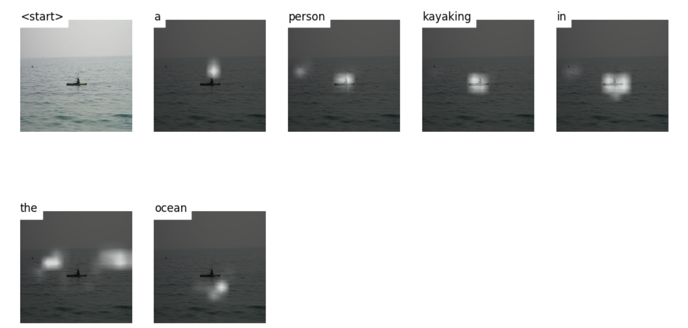

# Human Eyes: Project 2
**姓名:何雨琪  	学号:2018202183		组号:22**

## 任务描述
在本项目Human Eye中，需要对给定的一张图片输出一个描述字幕，我们使用CNN和LSTM建立一个模型。
我们主要以论文 `Show and Tell`,以及 `Show,Attend,and Tell`为基础进行算法的实现。通过论文的学习，我们可以使用CNN来提取图片特征，同时利用RNN来生成文字序列，在第二篇论文中还利用了注意力机制，这个机制模拟了人眼观察图片说出一句话时，每个单词参考的图片区域各有侧重。

## 数据选择以及数据处理
### 数据集选择
我们可以下载到的数据集有三个`MSCOCO’14 Dataset`, `Flickr30K Datase`以及`Flickr8k Dataset`，其中MSCOCO 训练集13G，验证集6G，为了提高我们的模型训练效率，我们决定采用 Flickr8k dataset,整个数据集大小为1.12G。
对于图片描述，我们使用的是Andrej Karpathy’s training, validation, and test splits。

### 数据预处理
- 图像处理
对于一张三通道的模型，我们需要通过Encoder得到一个高维的特征表达，我们使用在ImageNet上预训练模型`resnet50`作为Encoder，对于图片输入需要做一些处理：
	1. 要求pixel的范围为[0,1],同时用ImageNet的均值和方差做标准化
	2. 将图片resize到(256,256)

- 字幕处理
	1. 对字幕设置开始标志`<start>`.，结束标志`<end>`.
	2. 将句子用`<pad>`补长或者截断到统一长度
	3. 创建单词到数字的映射 `word map`，生成`word_map.json`文件

- 字幕长度
	 每个句子的长度都是：实际长度+2

 `python data_preprocessing`
通过这个代码，会将Flickr8k Dataset 划分成训练集和验证集，代码实现内容如下：

- 读入所有图片，并resize到(256,256),同时根据图像的描述分为训练集、测试集和验证集，创建三个HDF5文件。
- 创建三个对应的JSON文件，对应训练集，验证集和测试集的字幕，字母顺序和HDF5文件中图片顺序一致。每张图片有5个字幕，每句字幕都被统一到52的长度。
- 创建另外三个JSON文件，对应训练集、验证集和测试集的字幕长度。
- 创建word_map.json。

## Encoder
Encoder主要作用是将一张输入的三通道图片编码成一个固定格式的code,这个code可以作为原始图片的一个特征表达。我们使用预训练的`ResNet-50`进行特征提取,最后的提取的特征形状为(14,14,2048)。
`test_cnn.py`
此代码是对某张图片进行特征提取，正确产生了图像特征。

```python
class Encoder(nn.Module):
    def __init__(self, encoded_image_size=14):
        super(Encoder, self).__init__()
        self.enc_img_size = encoded_image_size
        cnn_ext = torchvision.models.resnet50(pretrained = True)  # 使用预训练的 resnet-50
        modules = list(cnn_ext.children())[:-2]  # 去掉网络中的最后两层
        self.cnn_ext = nn.Sequential(*modules)  # 使用 nn.Sequential 定义好 encoder

        self.adaptive_pool = nn.AdaptiveAvgPool2d((encoded_image_size, encoded_image_size))  # 使用 nn.AdaptiveAvgPool2d 将输出改变到指定的大小

    def forward(self, img):
        out = self.cnn_ext(img)  
        out = self.adaptive_pool(out)
        out = out.permute(0, 2, 3, 1)  
        return out

    def freeze_params(self, freeze):
        for p in self.cnn_ext.parameters():
            p.requires_grad = False

        for c in list(self.cnn_ext.children())[5:]:
            for p in c.parameters():
                p.requires_grad = (not freeze)
```


## Decoder
Decoder的主要作用就是通过编码之后的图像，一步一步生成一句图像描述。因为生成的字幕是一段序列，需要使用循环神经网络，这里使用LSTMcell.
包含Attention机制的Decoder实现在`models.py`中的Decoder。

### 使用word embedding 做词语预测：

在Decoder中，一个关键问题是表示出每个单词的词向量，我们使用word embedding来实现单词低维向量的快速输出。
在pytorch中实现word embedding是通过一个函数实现的：`nn.Embedding()`。

1. 我们需要把每个单词用一个数字标识，我们在数据预处理时已经创建了word_map
2. word embedding 的定义`nn.Embedding(vocab_size, embed_dim)`,表示将vocab_size个单词表示为embed_dim维

   在 `embedding_test.py`文件中，实现了word embedding做简单单词预测，其中使用的模型是N-Gram。

```python
#定义模型
class NgramModel(nn.Module):  
    def __init__(self, vocb_size, context_size, n_dim):  
        super(NgramModel, self).__init__()  
        self.n_word = vocb_size  
        self.embedding = nn.Embedding(self.n_word, n_dim)  
        self.linear1 = nn.Linear(context_size*n_dim, 128)  
        self.linear2 = nn.Linear(128, self.n_word)  
  
    def forward(self, x):  
        emb = self.embedding(x)  
        emb = emb.view(1, -1)  
        out = self.linear1(emb)  
        out = F.relu(out)  
        out = self.linear2(out)  
        log_prob = F.log_softmax(out)  
        return log_prob
```
```python
#训练
for epoch in range(100):  
    print('epoch: {}'.format(epoch+1))  
    print('*'*10)  
    running_loss = 0  
  for data in trigram:  
        word, label = data  
        word = Variable(torch.LongTensor([word_to_idx[i] for i in word]))  
        label =Variable(torch.LongTensor([word_to_idx[label]]))  
        # forward  
		out = ngrammodel(word)  
        loss = criterion(out, label)  
        print("loss:",running_loss)  
        print(loss.data)  
        running_loss += loss.item()  
        # backward  
		optimizer.zero_grad()  
        loss.backward()  
        optimizer.step()  
    print('Loss: {:.6f}'.format(running_loss / len(word_to_idx)))
```

### 不加Attention机制的LSTM算法流程：
我们将编码之后的特征做一个全局平均池化，然后通过仿射变换之后作为隐含状态 $h_0$ 输入到 LSTM 当中，然后可以生成一个单词，同时生成下一步的隐含状态 $h_1$，接着该隐含状态和当前预测的单词作为下一次的输入，再一次输入到 LSTM 当中得到下一步的输出，通过不断的生成，直到最后模型输出一个结束标志 `<end>`，就终止模型的继续生成。


### 加入Attention机制的LSTM算法流程：

加入attention机制，序列中生成一个单词时，模型需要学会每一个单词要关注图片中的哪一个位置。解码器不再是对特征做全局平均，而是先得到一个注意力矩阵，通过注意力矩阵与特征相乘，让模型知道应该注意哪些像素点，再输入Decoder中生成单词。


1. 需要传入Decoder一个初始的`hidden state` 和`cell state`,我们利用Encoder的输出`encoder_out`，通过两个线性层将其分别转换为`hidden state`和`cell state`,这里是通过函数`init_hidden_state()`实现。
```python
def init_hidden_state(self, encoder_out):  
    # 对所有的像素求平均  
	mean_encoder_out = encoder_out.mean(dim=1)  
    # 线性映射分别得到 hidden state 和 cell state  
    h = self.init_h(mean_encoder_out)  
    c = self.init_c(mean_encoder_out)  
    return h, c
```
2. 对输入进行一个排序,排序按照字幕长度降序排列，通过这个排序我们可以每个时间步都不用处理`<pad>`
```python
caption_lens, sort_idx = caption_lens.squeeze(1).sort(dim=0, descending=True)  
encoder_out = encoder_out[sort_idx]  
encoded_captions = encoded_captions[sort_idx]
```
3. 通过公式得到 $$ \phi = \beta (\sum_{i}^L \alpha_i a_i) \ \beta = \sigma (f_{\beta} (h_{t-1})) $$得到attention_weighted_encoding。

   ```python
   attention_weighted_encoding, alpha = self.attention(encoder_out[:batch_size_t],  h[:batch_size_t])
   gate = self.sigmoid(self.f_beta(h[:batch_size_t]))  # 根据公式计算 soft attention 结果 gate过滤
   attention_weighted_encoding = gate * attention_weighted_encoding
   ```
   
4. 将attention_weighted_encoding和embedding拼接在一起，与hidden state,cell state输入到LSTMCell中，得到新的hidden state(output), cell state。hidden state输出得到的每个单词得分决定当前的单词选择。
```python
h, c = self.decode_step(
                torch.cat([embeddings[:batch_size_t, t, :], attention_weighted_encoding], dim=1),
                (h[:batch_size_t], c[:batch_size_t]))
```

## Attention
Attention机制的实现在models.py中的AttentionModule。

### 注意力机制定义：

其网络层定义比较简单，仅仅是几个线性层和激活函数。

```python
    def __init__(self, encoder_dim, decoder_dim, attention_dim):
        super(AttentionModule, self).__init__()
        self.encoder_att = nn.Linear(encoder_dim, attention_dim) 
        self.decoder_att = nn.Linear(decoder_dim, attention_dim) 
        self.full_att = nn.Linear(attention_dim, 1)  
        self.relu = nn.ReLU()  
        self.softmax = nn.Softmax(dim=1)  
```


### 实现具体步骤：

- 将拉平的 `encoder_out (bs, 14*14, encoder_dim)` 线性映射到 `(bs, 14*14, attention_dim)` 得到 `att1`
- 将 decoder 中的 `decoder_hidden (bs, decoder_dim)` 线性映射到 `(bs, attention_dim)` 得到 `att2`
- 计算 `att = Linear(ReLU(att1 + att2))` 得到 `(bs, 14*14, 1)`
- 使用 `softmax` 得到注意力矩阵 `alpha (bs, 14*14)`，并将`alpha`和`encoder_out`左加权平均得到注意力机制的输出。

## 训练

训练过程在`train.py`文件中实现，通过运行`python train.py`进行训练。

### train

- 最大的训练迭代次数epoch为120，如果连续20个epoch模型的性能没有得到改善，就停止训练；如果连续8个epoch模型的性能没有得到改善，进行学习率衰减。（参数待优化）
- 使用交叉熵损失函数作为分类损失`CrossEntropyLoss`,根据论文还加入一个正则化约束`double stochastic regularization`,公式为：$$ \lambda \sum_{i}^L (1 - \sum_{t}^C \alpha_{t, i})^2 $$。对于注意力矩阵所有的像素权重之和是1，加入了这个约束，每个像素沿着时间维度上求和也是趋近于1，这样模型在生成每一个单词的时候每个像素都可以参与。

### 训练结果

我们在Flicker8k训练集上作出训练，准确率为70%。之后考虑对当前的模型进行优化，并采用更大的数据集。


## 测试：

输入图片，输出其字幕以及注意力热力图。

### 测试1：

输入：


输出：`a person kayaking in the ocean.`



### 测试2：

输入：


输出：`two people sit on a beach surrounded by trees.`


### 测试3：

输入：


输出：`a woman in a black and white outfit is standing on a skateboard`


## 总结与计划

从几个测试中可以发现，我们的训练结果并不理想，对于主题明确的图片，输出字幕较为准确，但对于主体较小、内容复杂的图像，输出字幕不理想。考虑是因为`训练集较小，CNN特征提取不够特定，Attention机制没有很好的将注意力集中`。我们将参考论文`Bottom-up and Top-Down Attention`使用R-CNN或者 faster R-CNN 对图像进行特征提取，准确识别图像类别。


